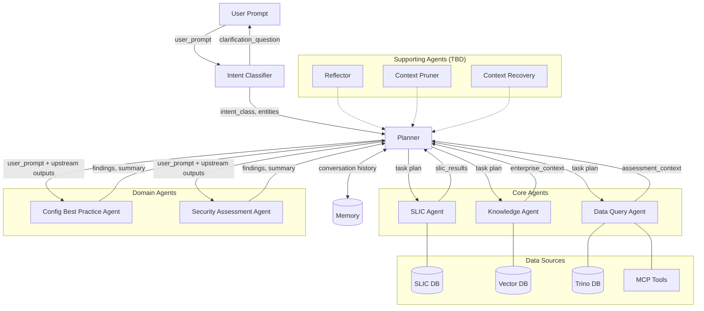

# Logical Architecture: Assessment Agentic AI

**Purpose:** Define the logical view of the Assessment Agentic Architecture — the agents, their responsibilities, relationships, and data flows. This view is **deployment-independent**: it describes *what* agents exist and *how* they interact, not *where* or *how* they run.

**Version:** v0.5  
**Date:** 2026-03-13

**Relationship to other documents:**
- [deployment_options.md](deployment_options.md) — the **deployment/physical view**: how these logical agents are mapped to runtime (services vs. graph nodes)
- [agents/*.md](agents/) — the **agent contracts**: detailed persona, inputs, outputs, and rules per agent

---

## 1. Agent Taxonomy

The architecture defines four categories of agents. All agents are LLM-powered with distinct personas and responsibilities. Every agent exposes one or more **skills** — the functional units of capability that define what the agent can do.

> **Agent** = the actor (persona, contract, runtime identity).  
> **Skill** = a specific capability within an agent (defined inputs, outputs, invocation rules).  
> The Planner routes to an **agent** and specifies which **skill** to invoke.

### Orchestration Agents

| Agent                                   | Role          | Skill(s)                | Primary Responsibility                                                                                       |
| --------------------------------------- | ------------- | ----------------------- | ------------------------------------------------------------------------------------------------------------ |
| **Semantic Router / Intent Classifier** | Pre-processor | `intent_classification` | Classify user intent, extract entities, determine routing. Short-circuits on ambiguity (clarification gate). |
| **Supervisor / Planner**                | Orchestrator  | `task_planning`         | Convert classified intent into a task plan, determine agent routing, manage execution ordering.              |

### Core Agents

| Agent                | Role                  | Skill(s)                           | Data Source          | Primary Responsibility                                                                                                                        |
| -------------------- | --------------------- | ---------------------------------- | -------------------- | --------------------------------------------------------------------------------------------------------------------------------------------- |
| **SLIC Agent**       | Data Retriever        | `slic_retrieval`                   | SLIC DB / Engine     | Retrieve SLIC results and annotations for downstream enrichment.                                                                              |
| **Knowledge Agent**  | Domain Expert         | `knowledge_retrieval`              | Vector DB (RAG)      | Formulate retrieval queries, provide enterprise knowledge (policies, standards, exceptions) to support assessment execution.                  |
| **Data Query Agent** | Infrastructure Expert | `data_query_mcp`, `data_query_sql` | Trino DB / MCP Tools | Retrieve and normalize device/network data into a canonical Assessment Context. Queries DB directly or via MCP tools with predefined queries. |

### Domain Agents

| Agent                          | Role      | Skill(s)                                               | Primary Responsibility                                                                                                   |
| ------------------------------ | --------- | ------------------------------------------------------ | ------------------------------------------------------------------------------------------------------------------------ |
| **Config Best Practice Agent** | Validator | `cbp_assessment`, `cbp_expert_insights`, `cbp_generic` | Analyze assessment data, summarize findings, assess configuration posture against best practices.                        |
| **Security Assessment Agent**  | Validator | `sec_assessment`, `sec_expert_insights`, `sec_generic` | Identify security risks and posture issues based on available data. Evidence-based, explicit about exposure assumptions. |

### Supporting Agents (TBD)

| Agent                | Role               | Skill(s)                      |
| -------------------- | ------------------ | ----------------------------- |
| **Reflector**        | Quality gate       | `answer_reflection` (TBD)     |
| **Context Pruner**   | Context management | `context_summarization` (TBD) |
| **Context Recovery** | Context management | `context_recovery` (TBD)      |

> The Ambiguity Handler is **not a separate agent** — ambiguity is handled by the Intent Classifier's `intent_classification` skill (clarification gate).

> Supporting agents are not yet scoped. Their placement in the execution flow (e.g., Reflector's impact on the single-pass constraint, Guardrails input/output filtering position) will be defined when these agents are scoped.

---

## 2. Skill Catalog

Skills are the universal unit of capability across the architecture. Every agent — orchestration, core, and domain — is built from skills. A skill defines specific inputs, outputs, and invocation conditions.

### Orchestration Skills

| Skill                   | Agent             | Inputs                      | Outputs                                                                                               | Invocation                                                       |
| ----------------------- | ----------------- | --------------------------- | ----------------------------------------------------------------------------------------------------- | ---------------------------------------------------------------- |
| `intent_classification` | Intent Classifier | User prompt, conversation context | Intent classification, meta-intent, domain details, extracted entities, confidence score, clarification question (if ambiguous) | Always — first node in every execution                           |
| `task_planning`         | Planner           | Classified intent output         | Ordered task list with agent assignments and dependencies, agent-to-task routing                                                | Always (when intent is not ambiguous)                            |

### Core Agent Skills

| Skill                 | Agent            | Inputs                                                  | Outputs                                                      | Invocation                                                                           |
| --------------------- | ---------------- | ------------------------------------------------------- | ------------------------------------------------------------ | ------------------------------------------------------------------------------------ |
| `slic_retrieval`      | SLIC Agent       | Intent entities, task definition                        | SLIC assessment results, annotations                         | Conditional — when SLIC data is needed (e.g., `cbp_expert_insights`)                 |
| `knowledge_retrieval` | Knowledge Agent  | Intent, plan context, conversation history              | Enterprise context (policies, standards, exceptions), retrieval query used | Conditional — always for `cbp_expert_insights`/`cbp_generic`; conditional for others |
| `data_query_mcp`      | Data Query Agent | Intent classification, extracted entities, MCP tool definitions | Assessment context (normalized device/network data)          | When intent maps to a supported MCP tool                                             |
| `data_query_sql`      | Data Query Agent | Intent classification, extracted entities, schema, ontology     | Assessment context (normalized device/network data)          | When intent is complex/bespoke or MCP unavailable                                    |

### Domain Agent Skills

| Skill                 | Agent                      | Required Upstream                                                        | Outputs                                                                                               | Trigger                              |
| --------------------- | -------------------------- | ------------------------------------------------------------------------ | ----------------------------------------------------------------------------------------------------- | ------------------------------------ |
| `cbp_assessment`      | Config Best Practice Agent | Data Query Agent (always), Knowledge Agent (conditional)                 | Structured findings, natural language summary, prioritized risks, asset trend analysis, chart hints    | Intent is a Config Best Practice assessment query      |
| `cbp_expert_insights` | Config Best Practice Agent | SLIC Agent (always), Data Query Agent (always), Knowledge Agent (always) | Structured findings, natural language summary                                                         | Intent is a Config Best Practice expert insights query |
| `cbp_generic`         | Config Best Practice Agent | Knowledge Agent (always)                                                 | Natural language summary                                                                              | Intent is a generic Config Best Practice question      |
| `sec_assessment`      | Security Assessment Agent  | Data Query Agent (always), Knowledge Agent (conditional)                 | Structured findings, natural language summary, prioritized risks                                      | Intent is a Security Assessment query                  |
| `sec_expert_insights` | Security Assessment Agent  | SLIC Agent (always), Data Query Agent (always), Knowledge Agent (always) | Structured findings, natural language summary                                                         | Intent is a Security Assessment expert insights query  |
| `sec_generic`         | Security Assessment Agent  | Knowledge Agent (always)                                                 | Natural language summary                                                                              | Intent is a generic Security Assessment question       |

### Supporting Agent Skills (TBD)

| Skill                   | Agent            | Purpose                                           |
| ----------------------- | ---------------- | ------------------------------------------------- |
| `answer_reflection`     | Reflector        | Critique and refine task results for quality      |
| `context_summarization` | Context Pruner   | Summarize conversation to mitigate semantic bloat |
| `context_recovery`      | Context Recovery | Recover missing context in multi-turn scenarios   |

### Skill Selection Logic

The Planner selects which skill to invoke on each agent based on `intent_class`:

```
intent_class ──▶ domain agent + skill
              ──▶ required core agent skills (from skill's data dependencies)
```

For example, `intent_class = "cbp_expert_insights"` triggers:
1. `slic_retrieval` on SLIC Agent (required)
2. `data_query_mcp` or `data_query_sql` on Data Query Agent (required)
3. `knowledge_retrieval` on Knowledge Agent (required)
4. `cbp_expert_insights` on Config Best Practice Agent (target skill)

---

## 3. Agent Relationships

```
                          ┌──────────┐
                User ────▶│ Intent   │
                          │Classifier│
                          └────┬─────┘
                               │
              ┌────────────────┼──── intent_class == "unknown_or_needs_clarification"
              │                │     → return clarification_question to User
              │                ▼
              │          ┌──────────┐       ┌──────────┐
              │          │ Planner  │◄─────▶│  Memory  │
              │          └──┬───┬───┘       └──────────┘
              │             │   │
              │    ┌────────┘   └────────┐
              │    ▼                     ▼
              │  Core Agents         Domain Agents
              │  ┌──────────┐        ┌──────────────────┐
              │  │ SLIC     │        │ Config Best      │
              │  │ Knowledge│───────▶│ Practice Agent   │
              │  │ Data Qry │        │ Security Assess. │
              │  └──────────┘        │ Agent            │
              │                      └──────────────────┘
              │
              ▼
           User (clarification)
```

**Key relationships:**

1. **User → Intent Classifier**: Every user prompt enters through the Intent Classifier
2. **Intent Classifier → Planner**: Classified intent (unless clarification needed)
3. **Intent Classifier → User**: Clarification question (short-circuit, pre-Planner gate)
4. **Planner → Core Agents**: Conditional invocation based on data dependencies
5. **Planner → Domain Agents**: Always invoked (one per intent_class)
6. **Core Agents → Domain Agents**: Data flows through the Planner (task outputs), not direct calls
7. **Planner ↔ Memory**: Conversation history, personalization, self-corrections

---

## 4. Data Flow

The architecture follows a **Planner/Execute** pattern. The Planner determines which agents run, in what order, and what data each agent needs. This section describes the logical data flow: **what** each agent produces and consumes, and **how** data moves between agents.

### 4.1 Data Flow Principles

- **Planner-mediated** — all inter-agent data flow is mediated by the Planner. Agents do not call each other directly; the Planner decides what each agent receives and collects what each agent produces.
- **Task-scoped** — each agent produces outputs for the specific task it was assigned. Those outputs are available to downstream agents as inputs.
- **Non-overlapping** — each agent produces a distinct set of outputs. No two agents produce the same artifact, so there is no risk of overwriting.
- **Traceable** — every agent's execution contributes to an observable trace.

### 4.2 Data Contracts

Each agent produces and consumes well-defined data artifacts.

**Intent Classifier produces:**
- `intent_class` — single classification label
- `meta_intent` — conversational-level intent
- `domain_details` — structured assessment metadata
- `entities[]` — targets, scope, constraints
- `confidence` — 0–1 score
- `clarification_question` — only when ambiguous

**Planner produces:**
- `tasks[]` — the complete task plan: all tasks with agent assignments, dependencies, status, and outputs
- `routing[]` — the execution cursor: which task(s) and agent(s) to invoke next, driving the Planner's dispatch loop

**Core Agents produce (per task):**
| Agent            | Output Artifact                         | Description                                                    |
| ---------------- | --------------------------------------- | -------------------------------------------------------------- |
| SLIC Agent       | `slic_results`, `annotations`           | SLIC assessment results and annotations                        |
| Knowledge Agent  | `enterprise_context`, `retrieval_query` | RAG-retrieved policies, standards, exceptions + the query used |
| Data Query Agent | `assessment_context`                    | Normalized device/network data (via MCP tools or SQL)          |

**Domain Agents produce (per task):**
| Output Artifact       | Description                                                   |
| --------------------- | ------------------------------------------------------------- |
| `findings[]`          | Structured findings with severity, confidence, evidence       |
| `summary`             | Natural language summary of analysis                          |
| `prioritized_risks[]` | Risk-ranked findings                                          |
| `asset_trend[]`       | Trend/delta analysis (Config Best Practice Agent, trend mode) |
| `chart_hints[]`       | Chart-ready data metadata for UI rendering (optional)         |

### 4.3 Example Data Flows by Skill

Each `intent_class` maps to a domain agent skill, which in turn determines which core agent skills are invoked and what data flows between them. Two examples illustrate the pattern:

#### `cbp_assessment` (Config Best Practice Agent skill)
User asks about assessment results, findings, statistics, trends, risk, or remediation.

```
Intent Classifier ──▶ Planner ──▶ Data Query Agent (always) ──▶ Knowledge Agent (conditional) ──▶ Config Best Practice Agent
                                        │                              │                                │
                                        │                              │                                ▼
                                        │                              │              reads: assessment_context (from Data Query Agent)
                                        │                              │              reads: enterprise_context (from Knowledge Agent, if available)
                                        │                              │              writes: findings[], summary, prioritized_risks[]
                                        │                              ▼
                                        │              writes: enterprise_context, retrieval_query
                                        ▼
                                  writes: assessment_context (via MCP tools or SQL)
```

#### `cbp_expert_insights` (Config Best Practice Agent skill)
Assessment data contains SLIC findings that must be enriched with enterprise knowledge. This is the fullest pipeline — all core agents are invoked.

```
Intent Classifier ──▶ Planner ──▶ SLIC Agent (always) ──▶ Data Query Agent (always) ──▶ Knowledge Agent (always) ──▶ Config Best Practice Agent
                                        │                        │                            │                            │
                                        ▼                        ▼                            ▼                            ▼
                                  writes: SLIC            writes: assessment           writes: enterprise           reads: all upstream
                                  results                 context                      context                      writes: findings[], summary
```

The remaining skills (`cbp_generic`, `sec_assessment`, `sec_expert_insights`, `sec_generic`, `unknown_or_needs_clarification`) follow the same pattern with varying core agent invocations as defined in §2 Skill Catalog.


---

## 5. Data Sources

| Data Source          | Accessed By      | Contains                                                                                                                              |
| -------------------- | ---------------- | ------------------------------------------------------------------------------------------------------------------------------------- |
| **SLIC DB / Engine** | SLIC Agent       | SLIC assessment results, annotations                                                                                                  |
| **Vector DB**        | Knowledge Agent  | Human annotations, institutional knowledge, policies, standards, approved exceptions                                                  |
| **Trino DB**         | Data Query Agent | Assessment metadata, raw configuration data, schema cache, runtime context                                                            |
| **MCP Tools**        | Data Query Agent | Configurations MCP Server — domain-first, parameterized tools covering the full Config Best Practice data surface |

### Data Query Agent: Dual-Path Retrieval

The Data Query Agent has two retrieval strategies, selected deterministically. The **Data Query Agent owns the MCP-vs-SQL decision** — the Planner assigns a data retrieval task without specifying which path to use, and the Data Query Agent selects the appropriate strategy internally based on intent, available MCP tools, and domain coverage.

| Path         | When Used                                  | How It Works                                                                  |
| ------------ | ------------------------------------------ | ----------------------------------------------------------------------------- |
| **MCP Path** | Intent maps to a supported MCP tool        | Select tool by intent + entities → execute → normalize results                |
| **SQL Path** | Complex/bespoke intent, or MCP unavailable | Read schema + ontology → generate read-only SQL → execute → normalize results |

> **Constraint:** For any domain, the MCP path must provide complete data coverage — the SQL path is a migration bridge only. See §7 invariant #11.

### MCP Tool Design: Parameterized Approach

The MCP tool surface follows a **parameterized approach** — a small number of domain-scoped tools with rich parameter schemas — rather than a many-specific-tools approach where each query pattern gets its own dedicated tool.

| Approach | Description | Trade-off |
|----------|-------------|-----------|
| **Many specific tools** | One tool per query pattern (e.g., `get_risk_by_product_family`, `get_trend_by_technology`, `get_findings_by_severity`) | Explicit and easy to test, but rigid — every new query pattern requires a new tool, leading to tool sprawl and combinatorial explosion as filter/grouping dimensions grow |
| **Few parameterized tools** (adopted) | Small number of tools with rich parameter schemas — `view_mode`, `group_by`, `metrics`, `filters`, `asset_scope` control what data is returned and how it is shaped | Covers the full combinatorial space of filters, aggregations, and groupings without tool proliferation; parameter validation replaces tool selection as the complexity surface |

**Why parameterized is preferred:**

1. **Combinatorial coverage** — Config Best Practice queries combine arbitrary filters (severity, product family, technology, OS), aggregation modes (count, distribution, top-N), and grouping dimensions. Parameterized tools cover these combinations through parameter composition rather than requiring a dedicated tool for each permutation.
2. **Reduced tool selection burden on the LLM** — fewer tools means simpler tool-selection reasoning for the Data Query Agent. Instead of choosing among dozens of narrow tools, the agent selects one of a few domain tools and expresses intent through parameters.
3. **Stable tool surface** — new query patterns (new filters, new grouping dimensions) are added as parameter values, not new tools. The tool contract remains stable as the data model evolves.
4. **Consistent response envelope** — all parameterized tools share a common response structure, enabling deterministic multi-tool result merging in agent memory.
5. **Testability at the parameter level** — each tool's parameter space is validated with explicit enums, allow-lists, and incompatible-parameter rules. Coverage is verified by mapping canonical questions to specific tool + parameter combinations.

The current Config Best Practice MCP tool surface implements four parameterized tools: `search_assets_scope` (asset-dimension filter resolution), `query_findings` (finding records, aggregates, execution overview), `query_rules` (rule catalog and impact), and `query_insights` (AI-generated insights). See the [Configurations MCP Server Design Overview](https://cisco-cxe.atlassian.net/wiki/spaces/CIA/pages/1066008593) for detailed tool contracts and question-to-tool mappings.

---

## 6. Execution Model

### 6.1 Single-Pass Planner/Execute

The execution follows a deterministic, single-pass pattern:

1. **Classify** — Intent Classifier produces `intent_class`, `entities[]`, `confidence`
2. **Gate** — If ambiguous (confidence below configurable threshold, e.g. 0.5), return clarification question to user (short-circuit)
3. **Plan** — Planner reads intent, builds ordered `tasks[]` with dependencies and routing
4. **Execute** — Tasks run respecting `depends_on[]`:
   - Tasks with no mutual dependency may run in parallel (e.g., Data Query Agent and Knowledge Agent when neither depends on the other)
   - Core agents run before domain agents (core agents produce the data domain agents consume)
   - Domain agents run last, consuming upstream outputs
5. **Return** — Final STATE with all task outputs is returned

There is **no replanning** in the current architecture. If data is insufficient, domain agents qualify their findings with `data_gaps[]`, `assumptions[]`, and lower `confidence` scores rather than requesting re-execution.

### 6.2 Conditional Invocation Rules

The Planner invokes agents by skill, based on the domain skill's data dependencies (see §2 Skill Catalog):

| Agent                | Skill(s)                                                  | Invocation Rule                                                                |
| -------------------- | --------------------------------------------------------- | ------------------------------------------------------------------------------ |
| **SLIC Agent**       | `slic_retrieval`                                          | When SLIC data is needed (e.g., `cbp_expert_insights`, `sec_expert_insights`)  |
| **Knowledge Agent**  | `knowledge_retrieval`                                     | Always for `*_expert_insights` and `*_generic`; conditional for `*_assessment` |
| **Data Query Agent** | `data_query_mcp` or `data_query_sql`                      | Always for `*_assessment` and `*_expert_insights`; never for `*_generic`       |
| **CBP Agent**        | `cbp_assessment`, `cbp_expert_insights`, or `cbp_generic` | When `intent_class` ∈ {`cbp_assessment`, `cbp_expert_insights`, `cbp_generic`} |
| **SA Agent**         | `sec_assessment`, `sec_expert_insights`, or `sec_generic` | When `intent_class` ∈ {`sec_assessment`, `sec_expert_insights`, `sec_generic`} |

### 6.3 Memory

Memory is accessible to all agents. 
It contains:
- **Conversation history** — multi-turn context
- **Personalization** — user preferences and context
- **Self-corrections** — prior corrections applied during the session
- **Agent memory** — learned patterns from prior executions

Each agent may read conversation history, prior corrections, and relevant context from Memory to inform its execution. How Memory is shared across agents — whether via a shared state object, injected context, or other mechanism — is an implementation concern. Per-agent Memory usage patterns are documented in the individual agent contracts.

Memory is not a separate agent.

### 6.4 Error Propagation

When an upstream agent fails to produce output, the error propagation policy depends on whether the dependency is required or optional (as declared in the domain skill's "Required Upstream" column in §2):

- **Required dependency fails → fail-stop.** If a required upstream agent cannot produce output (e.g., Data Query Agent MCP call fails for a `cbp_assessment` task), execution terminates. The failure reason is returned to the user with a clear explanation of which agent failed and why the request could not be completed.
- **Optional dependency fails → fail-forward.** If a conditional/optional upstream agent cannot produce output (e.g., Knowledge Agent retrieval returns nothing for a `cbp_assessment` task where Knowledge Agent is conditional), execution continues. The domain agent proceeds with degraded inputs and must qualify its outputs — surfacing the missing dependency in its results so the user understands which context was unavailable and how it affects the analysis.
- **All failures are traced.** Whether fail-stop or fail-forward, the failure is recorded in the execution trace with the agent name, failure reason, and impact on downstream tasks.

---

## 7. Invariants

These properties hold true for the logical architecture:

1. **Every agent is built from skills** — skills are the universal unit of capability; agents are containers for one or more skills
2. **Agent contracts are stable** — each agent's persona, skills, inputs, outputs, and rules are defined in `agents/*.md`
3. **Data flows through the Planner** — agents do not call each other directly; the Planner mediates all inter-agent data flow
4. **Task-scoped outputs** — each agent produces outputs for the specific task it was assigned; no two agents produce the same artifact
5. **Single-pass execution** — no replanning, no cycles (Phase 1)
6. **Clarification gate is pre-Planner** — ambiguity resolution happens before any planning or execution
7. **Domain agents never fetch data** — they consume upstream task outputs only
8. **Planner never fetches data** — it orchestrates, delegates, and aggregates
9. **Intent Classifier never plans** — it classifies and extracts, nothing more
10. **Trace provenance** — every agent appends execution trace for observability
11. **MCP tools cover the full domain data surface** — MCP tools must cover 100% of the Config Best Practice data domain. The SQL path exists only as a migration bridge or for non-Config Best Practice domains. For Config Best Practice in Q3 GA, every answerable user prompt must be serviceable through MCP tools alone.

---

## 8. Logical Architecture Diagram (Mermaid)



---

## 9. What This Document Does NOT Cover

This logical view is deliberately deployment-agnostic. The following concerns are addressed in other documents:

| Concern                                                 | Document                                                                             |
| ------------------------------------------------------- | ------------------------------------------------------------------------------------ |
| Formal GraphState schema (concrete state structure)     | Implementation layer (derives from §4.2 data contracts)                              |
| How agents are deployed (services vs. graph nodes)      | [deployment_options.md](deployment_options.md)                                       |
| Whether core agents are shared or duplicated per domain | [deployment_options.md](deployment_options.md)                                       |
| Communication protocol (A2A, HTTP, shared state)        | [deployment_options.md](deployment_options.md)                                       |
| Scaling, containers, process boundaries                 | [deployment_options.md](deployment_options.md)                                       |
| How agents acquire capabilities (static vs. dynamic)    | [agent_capability_architecture.md](agent_capability_architecture.md)                 |
| Agent Skills, contextual inheritance, migration path    | [agent_capability_architecture.md](agent_capability_architecture.md)                 |
