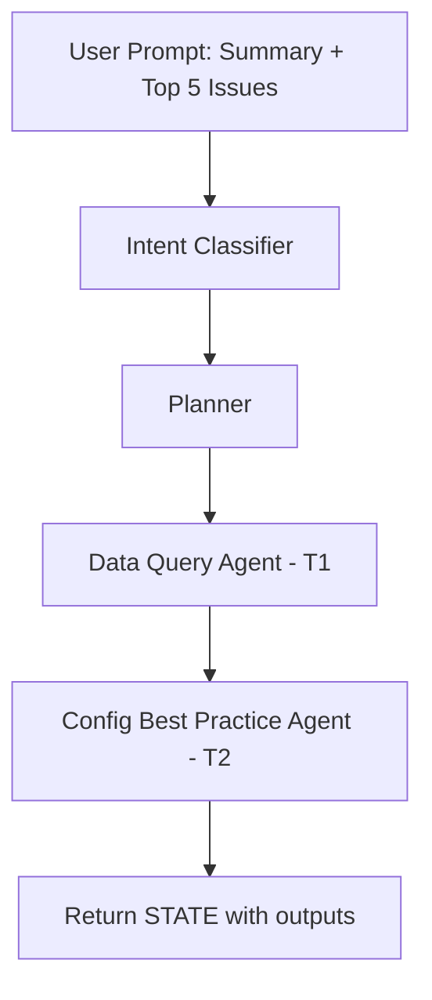

# Emulation Trace 001: Configuration Assessment Summary

**User Prompt**: "Provide me a summary of the configuration best practice assessment, show the top 5 issues."

**Execution Date**: 2026-02-23

---

## 1) Intent Classification

```json
{
  "intent": {
    "intent_class": "assessment_summary",
    "entities": [],
    "confidence": 0.95
  }
}
```

**Analysis**:
- **intent_class**: `assessment_summary` - User requesting summary of existing assessment results
- **entities**: No specific scope entities (site, device, timeframe) extracted
- **confidence**: 0.95 - Clear intent, straightforward request

---

## 2) Graph Flow Map



**Flow Explanation**:
- Knowledge Agent **not invoked** (no enterprise context interpretation needed)
- Data Query Agent **invoked** (Config Best Practice Agent has data dependencies)
- Single-pass execution (no cycles)

---

## 3) Node-by-Node Trace

### Node 1: Intent Classifier
**Persona**: Semantic Router - precise, confidence-scored intent extraction

**Input**:
- `STATE.input.user_prompt`: "Provide me a summary of the configuration best practice assessment, show the top 5 issues."

**Action**:
- Classified intent as `assessment_summary` (existing assessment, not new validation)
- No specific entities extracted (no site/device/timeframe mentioned)
- High confidence (0.95) - unambiguous request

**State Update**:
```json
STATE.intent = {
  "intent_class": "assessment_summary",
  "entities": [],
  "confidence": 0.95
}
```

**Exit Logic**: Transitions to Planner (deterministic flow)

---

### Node 2: Planner
**Persona**: Orchestrator - task-driven, dependency-aware planning

**Input**:
- `STATE.intent.intent_class`: "assessment_summary"
- `STATE.intent.entities`: []

**Action**:
- **Step 1 - Classify Planning Requirement**:
  - Intent: assessment_summary (query-based, not validation)
  - Domain: Configuration best practices
  - Primary agent: Config Best Practice Agent
  
- **Step 2 - Map Tasks to Agents**:
  - Config Best Practice Agent requires `assessment_context` (per data dependencies)
  - Data Query Agent needed to fetch assessment data
  - Knowledge Agent not needed (no enterprise context interpretation required)

- **Step 3 - Determine Dependencies**:
  - T1 (Data Query Agent) - no dependencies
  - T2 (Config Best Practice Agent) - depends_on: ["T1"]

- **Step 4 - Populate Data Requirements**:
  - T2.required_data: `[{data_path: "assessment_context", min_count: 1, priority: "required"}]`

**State Update**:
```json
STATE.plan = {
  "tasks": [
    {
      "id": "T1",
      "owner": "Data Query Agent",
      "depends_on": [],
      "status": "pending",
      "outputs": {}
    },
    {
      "id": "T2",
      "owner": "Config Best Practice Agent",
      "depends_on": ["T1"],
      "required_data": [
        {
          "data_path": "assessment_context",
          "min_count": 1,
          "priority": "required"
        }
      ],
      "status": "pending",
      "outputs": {}
    }
  ],
  "routing": [
    {"sequence": 1, "agent": "Data Query Agent", "task_id": "T1"},
    {"sequence": 2, "agent": "Config Best Practice Agent", "task_id": "T2"}
  ]
}
```

**Exit Logic**: Executes T1 first (no dependencies)

---

### Node 3: Data Query Agent (T1)
**Persona**: Data fetcher - MCP/SQL dual-path, semantic entity mapper

**Input**:
- `STATE.intent.intent_class`: "assessment_summary"
- `STATE.intent.entities`: []
- `STATE.plan.tasks[0]` (T1, status: "in_progress")

**Action**:
- **Step 1 - Determine Data Path**:
  - Intent is well-known: "assessment_summary"
  - MCP Path selected (well-known intent maps to MCP tool)

- **Step 2 - Select MCP Tool**:
  - Intent: assessment_summary
  - Pattern match: `get_assessment_summary` tool
  - No entity-to-parameter binding needed (no entities provided)

- **Step 3 - Invoke Tool**:
  - Tool: `get_assessment_summary()`
  - Parameters: `{}` (defaults to latest/all configs)
  - Result: `unknown` (tool execution not simulated)

- **Step 4 - Write Outputs**:
  - Structure: `{source_path: "mcp", report_data: {...}, scope: {}, provenance: [], errors: []}`

**State Update**:
```json
STATE.plan.tasks[0] = {
  "id": "T1",
  "owner": "Data Query Agent",
  "depends_on": [],
  "status": "completed",
  "outputs": {
    "assessment_context": {
      "source_path": "mcp",
      "report_data": "unknown",
      "scope": {},
      "provenance": [
        {
          "tool": "get_assessment_summary",
          "invoked_at": "2026-02-23T14:30:00Z"
        }
      ],
      "errors": []
    }
  }
}

STATE.trace.state_deltas.push({
  "node": "Data Query Agent",
  "task": "T1",
  "action": "Invoked get_assessment_summary MCP tool, wrote assessment_context to task outputs"
})
```

**Exit Logic**: T1 complete, graph proceeds to T2 (dependency satisfied)

---

### Node 4: Config Best Practice Agent (T2)
**Persona**: Configuration validator - evidence-based, explicit about uncertainty

**Input**:
- `STATE.intent.intent_class`: "assessment_summary"
- `STATE.intent.entities`: []
- `STATE.plan.tasks[0].outputs.assessment_context` (from T1)
- `STATE.plan.tasks[1]` (T2, status: "in_progress")

**Action**:
- **Step 1 - Input Validation**:
  - assessment_context exists: ✓
  - assessment_context.source_path: "mcp"
  - assessment_context.report_data: "unknown" (not provided in emulation)
  - No errors in assessment_context.errors[]

- **Step 2 - Understand User Intent**:
  - Intent class: "assessment_summary"
  - User asks for: summary + top 5 issues
  - Response type: Natural language summary (not findings array)

- **Step 3 - Analysis** (with unknown data):
  - Cannot perform actual analysis (tool results = "unknown")
  - Would parse report_data structure
  - Would extract key metrics, issues, trends
  - Would identify top 5 issues by severity/impact

- **Step 4 - Generate Summary**:
  - Format: Natural language response
  - Structure: Overview + Top 5 issues + Data gaps note
  - Output to: `task.outputs.summary`

**State Update**:
```json
STATE.plan.tasks[1] = {
  "id": "T2",
  "owner": "Config Best Practice Agent",
  "depends_on": ["T1"],
  "required_data": [
    {
      "data_path": "assessment_context",
      "min_count": 1,
      "priority": "required"
    }
  ],
  "status": "completed",
  "outputs": {
    "summary": "Assessment summary unavailable - MCP tool results not provided. In actual execution, this would contain:\n\n**Configuration Assessment Overview**\n- Total devices assessed: [count]\n- Assessment timeframe: [dates]\n- Overall compliance score: [percentage]\n\n**Top 5 Configuration Issues**\n1. [Issue 1 - severity, affected devices, impact]\n2. [Issue 2 - severity, affected devices, impact]\n3. [Issue 3 - severity, affected devices, impact]\n4. [Issue 4 - severity, affected devices, impact]\n5. [Issue 5 - severity, affected devices, impact]\n\n**Data Source**: MCP tool `get_assessment_summary`\n**Note**: Actual data not available in emulation - results marked as 'unknown'",
    "data_gaps": [
      "MCP tool results not provided - cannot generate actual summary"
    ]
  }
}

STATE.trace.state_deltas.push({
  "node": "Config Best Practice Agent",
  "task": "T2",
  "action": "Generated summary response, noted data unavailability in outputs.data_gaps"
})
```

**Exit Logic**: T2 complete, all tasks finished, graph returns final STATE

---

## 4) Final Assessment Outcome

### Response Type
Natural language summary (not structured findings)

### Extracted Output
**From**: `STATE.plan.tasks[1].outputs.summary` (Config Best Practice Agent)

**Summary**:
Assessment summary unavailable - MCP tool results not provided. In actual execution, this would contain:

**Configuration Assessment Overview**
- Total devices assessed: [count]
- Assessment timeframe: [dates]
- Overall compliance score: [percentage]

**Top 5 Configuration Issues**
1. [Issue 1 - severity, affected devices, impact]
2. [Issue 2 - severity, affected devices, impact]
3. [Issue 3 - severity, affected devices, impact]
4. [Issue 4 - severity, affected devices, impact]
5. [Issue 5 - severity, affected devices, impact]

**Data Source**: MCP tool `get_assessment_summary`

### Data Gaps
- MCP tool execution results not provided in emulation
- Actual assessment data unavailable

### Assumptions
- Latest configuration assessment would be retrieved by `get_assessment_summary` with no parameters
- Top 5 issues would be ranked by severity and impact
- No enterprise context interpretation needed for straightforward summary request

---

## 5) State Structure Summary

### Final STATE Object
```json
{
  "input": {
    "user_prompt": "Provide me a summary of the configuration best practice assessment, show the top 5 issues.",
    "context_kv": {}
  },
  "intent": {
    "intent_class": "assessment_summary",
    "entities": [],
    "confidence": 0.95
  },
  "plan": {
    "tasks": [
      {
        "id": "T1",
        "owner": "Data Query Agent",
        "depends_on": [],
        "status": "completed",
        "outputs": {
          "assessment_context": {
            "source_path": "mcp",
            "report_data": "unknown",
            "scope": {},
            "provenance": [
              {
                "tool": "get_assessment_summary",
                "invoked_at": "2026-02-23T14:30:00Z"
              }
            ],
            "errors": []
          }
        }
      },
      {
        "id": "T2",
        "owner": "Config Best Practice Agent",
        "depends_on": ["T1"],
        "required_data": [
          {
            "data_path": "assessment_context",
            "min_count": 1,
            "priority": "required"
          }
        ],
        "status": "completed",
        "outputs": {
          "summary": "[Natural language summary as shown above]",
          "data_gaps": [
            "MCP tool results not provided - cannot generate actual summary"
          ]
        }
      }
    ],
    "routing": [
      {"sequence": 1, "agent": "Data Query Agent", "task_id": "T1"},
      {"sequence": 2, "agent": "Config Best Practice Agent", "task_id": "T2"}
    ]
  },
  "routing": {
    "well_known_intents": ["assessment_summary"],
    "last_decision": "mcp_path"
  },
  "trace": {
    "node_run_order": [
      "Intent Classifier",
      "Planner",
      "Data Query Agent",
      "Config Best Practice Agent"
    ],
    "state_deltas": [
      {
        "node": "Intent Classifier",
        "action": "Classified intent as assessment_summary, extracted 0 entities"
      },
      {
        "node": "Planner",
        "action": "Created 2-task plan: T1 (Data Query Agent) → T2 (Config Best Practice Agent)"
      },
      {
        "node": "Data Query Agent",
        "task": "T1",
        "action": "Invoked get_assessment_summary MCP tool, wrote assessment_context to task outputs"
      },
      {
        "node": "Config Best Practice Agent",
        "task": "T2",
        "action": "Generated summary response, noted data unavailability in outputs.data_gaps"
      }
    ]
  }
}
```

---

## 6) Architectural Observations

### Conditional Agent Invocation
✅ **Knowledge Agent**: Not invoked - no enterprise context interpretation needed
✅ **Data Query Agent**: Invoked - domain agent has data dependencies
✅ **Domain Agent**: Invoked - performs analysis/summary

### Task-Embedded Outputs
✅ All agent outputs written to `tasks[].outputs`
✅ No separate `STATE.data.*` or `STATE.findings.*` sections
✅ Clear provenance: each task's outputs traceable to specific agent

### Single-Pass Execution
✅ No replanning or cycles
✅ Data gaps handled with explicit documentation in outputs
✅ Agent proceeded with available data rather than blocking

### Data Path Selection
✅ MCP Path chosen for well-known intent
✅ Tool selection based on intent pattern matching
✅ No entity-to-parameter binding needed (no entities extracted)

---

## 7) Key Differences from Legacy Architecture

| Aspect | Legacy | Current |
|--------|--------|---------|
| **SLIC Agent** | Invoked for all assessments | Removed from architecture |
| **Output Location** | `STATE.findings.*` | `tasks[].outputs.findings[]` |
| **Data Context** | `STATE.data.*` | `tasks[].outputs.assessment_context` |
| **Enterprise Knowledge** | `STATE.knowledge.*` | `tasks[].outputs.enterprise_context` |
| **Replanning** | Max 2 iterations | Single-pass only |
| **Data Gaps** | Block/replan | Document in outputs, proceed |
| **Knowledge Agent** | Always invoked | Conditional (not in this trace) |

