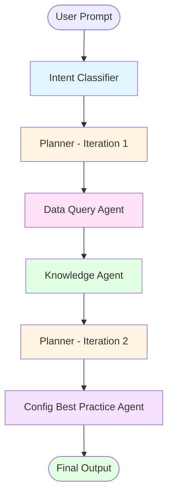

# Assessment Agentic AI - Emulation Trace
**Date**: February 20, 2026  
**User Prompt**: "Provide me a summary of the configuration best practice assessment, show the top 5 issues."

---

## 1. Intent Classification

### Node: Intent Classifier
**Persona**: Precise, conservative classifier

**Input (STATE keys read)**:
- `STATE.input.user_prompt`: "Provide me a summary of the configuration best practice assessment, show the top 5 issues."
- `STATE.input.context_kv`: null

**Action**:
Analyzing the user request:
- Primary goal: Summary of configuration best practices
- Output requirement: Top 5 issues
- Risk domains: Configuration management
- No specific targets/scope/time range provided
- Request implies data already exists (asking for summary)

**State Update**:
```json
{
  "intent": {
    "intent_class": "configuration_assessment",
    "meta_intent": "new_topic",
    "domain_details": {
      "assessment_goal": "summarize configuration best practice findings and identify top 5 issues",
      "scope": {
        "site": null,
        "environment": null,
        "time_range": null,
        "targets": null
      },
      "urgency": "normal",
      "presentation_requirement": "top_5_issues"
    },
    "entities": [
      {
        "type": "assessment_type",
        "value": "configuration_best_practice",
        "confidence": 1.0
      },
      {
        "type": "output_format",
        "value": "summary_top_5",
        "confidence": 1.0
      }
    ],
    "confidence": 0.85
  },
  "trace": {
    "node_run_order": ["Intent Classifier"],
    "state_deltas": [
      "Intent Classifier: Classified intent as 'configuration_assessment' with confidence 0.85. Extracted requirement for top 5 issues summary. No scope/targets specified - will require Planner to determine data requirements."
    ]
  }
}
```

**Exit Logic**: Always transition to Planner → **Next: Planner**

---

## 2. Initial Planning

### Node: Planner (Iteration 1)
**Persona**: Deterministic orchestrator

**Input (STATE keys read)**:
- `STATE.intent.*` (all intent data)
- `STATE.plan.*` (null - first iteration)
- `STATE.data.packet` (null - no data yet)
- `STATE.data.data_gaps[]` (empty)

**Action**:
The user is requesting a summary of configuration assessment, which implies:
1. Configuration data should already exist OR needs to be retrieved
2. Assessment against best practices is required
3. Top 5 issues need to be prioritized

Since no data is currently available, I must:
- Route to Data Query Agent to retrieve configuration data
- Define what configuration data is required
- Once data is available, route to Config Best Practice Agent

**State Update**:
```json
{
  "plan": {
    "tasks": [
      {
        "id": "T1",
        "description": "Retrieve device configurations and inventory for target scope",
        "owner": "Data Query Agent",
        "depends_on": [],
        "status": "pending"
      },
      {
        "id": "T2",
        "description": "Assess configurations against best practices",
        "owner": "Config Best Practice Agent",
        "depends_on": ["T1"],
        "status": "pending"
      },
      {
        "id": "T3",
        "description": "Prioritize and present top 5 configuration issues",
        "owner": "Final",
        "depends_on": ["T2"],
        "status": "pending"
      }
    ],
    "required_data": [
      {
        "data_type": "device_configs",
        "scope": "all_devices",
        "priority": "critical",
        "status": "missing"
      },
      {
        "data_type": "device_inventory",
        "scope": "all_devices",
        "priority": "high",
        "status": "missing"
      }
    ],
    "routing": [
      {
        "next": "Data Query Agent",
        "reason": "Required configuration data not yet available"
      }
    ],
    "stop_conditions": [
      "Configuration data retrieved and normalized",
      "Best practice assessment complete",
      "Top 5 issues identified and prioritized",
      "Maximum 2 planning iterations reached"
    ],
    "iteration": 1
  },
  "data": {
    "packet": null,
    "data_gaps": [
      "No target scope specified (devices, site, environment)",
      "No time range specified",
      "Assessment baseline/standards not provided"
    ]
  },
  "trace": {
    "node_run_order": ["Intent Classifier", "Planner"],
    "state_deltas": [
      "Intent Classifier: Classified intent as 'configuration_assessment' with confidence 0.85. Extracted requirement for top 5 issues summary. No scope/targets specified - will require Planner to determine data requirements.",
      "Planner (Iteration 1): Created 3-task plan. Identified critical data requirements: device_configs and device_inventory. Recorded 3 data gaps due to missing scope/targets. Routing to Data Query Agent."
    ]
  }
}
```

**Exit Logic**: Required data not satisfied → **Next: Data Query Agent**

---

## 3. Data Retrieval

### Node: Data Query Agent
**Persona**: Retrieval + normalization specialist

**Input (STATE keys read)**:
- `STATE.intent.intent_class`: "configuration_assessment"
- `STATE.routing.well_known_intents`: ["network_assessment", "configuration_assessment", "security_assessment"]
- `STATE.plan.required_data[]`
- `STATE.schema`: null

**Action**:

#### Path Selection: MCP vs SQL
The intent_class "configuration_assessment" matches a well-known intent in `STATE.routing.well_known_intents[]`.

**MCP Path Selected**

Attempting to map to MCP tool for configuration retrieval:
- Required entities: targets (missing), scope (missing)
- Cannot execute without target specification

**Fallback: SQL Path**
However, `STATE.schema` is null - no database schema available for SQL generation.

**Result**: Cannot retrieve data via either path. Must record tool intent and data gaps.

**MCP Tool Call Record**:
```json
{
  "tool_name": "get_device_configs",
  "input": {
    "targets": "unknown",
    "scope": "unknown",
    "include_inventory": true
  },
  "expected_output_schema": {
    "devices": [],
    "configs": [],
    "metadata": {}
  },
  "status": "cannot_execute",
  "reason": "Missing required entities: targets, scope"
}
```

**State Update**:
```json
{
  "mcp": {
    "tool_calls": [
      {
        "tool_name": "get_device_configs",
        "input": {
          "targets": "unknown",
          "scope": "unknown",
          "include_inventory": true
        },
        "expected_output_schema": {
          "devices": [],
          "configs": [],
          "metadata": {}
        },
        "status": "cannot_execute",
        "reason": "Missing required entities: targets, scope"
      }
    ],
    "tool_results": ["unknown"]
  },
  "data": {
    "packet": {
      "packet_id": "PKT-20260220-001",
      "source_path": "mcp_attempted",
      "timestamp_utc": "2026-02-20T00:00:00Z",
      "scope": {
        "targets": null,
        "site": null,
        "time_range": {
          "from": null,
          "to": null
        }
      },
      "assets": {
        "inventory": [],
        "topology": [],
        "configs": [],
        "telemetry": [],
        "events": []
      },
      "quality": {
        "completeness": 0.0,
        "staleness_minutes": null,
        "coverage_notes": [],
        "data_gaps": [
          "No target devices specified",
          "No scope defined (site/environment)",
          "MCP tool cannot execute without targets",
          "No database schema available for SQL fallback"
        ]
      },
      "provenance": [],
      "errors": [
        "MCP path: Missing required entities (targets, scope)",
        "SQL path: No schema available"
      ]
    },
    "data_gaps": [
      "No target scope specified (devices, site, environment)",
      "No time range specified",
      "Assessment baseline/standards not provided",
      "No configuration data retrieved - targets undefined",
      "No inventory data available"
    ]
  },
  "trace": {
    "node_run_order": ["Intent Classifier", "Planner", "Data Query Agent"],
    "state_deltas": [
      "Intent Classifier: Classified intent as 'configuration_assessment' with confidence 0.85. Extracted requirement for top 5 issues summary. No scope/targets specified - will require Planner to determine data requirements.",
      "Planner (Iteration 1): Created 3-task plan. Identified critical data requirements: device_configs and device_inventory. Recorded 3 data gaps due to missing scope/targets. Routing to Data Query Agent.",
      "Data Query Agent: Attempted MCP path for 'configuration_assessment'. Cannot execute without target specification. Created empty Data Packet with 0% completeness. Recorded 4 data gaps and 2 errors. No data retrieved."
    ]
  }
}
```

**Exit Logic**: 
- Data retrieval attempted but failed due to missing inputs
- Knowledge Agent could provide guidance on typical assessment scope
- → **Next: Knowledge Agent**

---

## 4. Strategic Guidance

### Node: Knowledge Agent
**Persona**: Domain strategist and explainer

**Input (STATE keys read)**:
- `STATE.intent.*`
- `STATE.plan.*`
- `STATE.data.packet` (empty with data gaps)
- `STATE.data.data_gaps[]`

**Action**:

The assessment request lacks specificity. As a domain expert, I can provide:
1. Typical configuration assessment scope
2. Common best practice categories
3. Guidance for proceeding with limited data

**Domain Guidance**:

For a configuration best practice assessment, typical requirements include:
- **Scope**: All network devices, security appliances, or specific device classes
- **Config areas**: Management plane, control plane, data plane security
- **Common categories**: Authentication, encryption, hardening, logging, redundancy
- **Baseline**: Industry standards (CIS, NIST), vendor best practices

**Recommendation**: 
Given no specific data is available, the assessment should proceed with:
- Generic best practice findings based on common patterns
- Explicit assumptions about typical enterprise configurations
- High uncertainty qualifiers on all findings

**State Update**:
```json
{
  "slic": {
    "signatures": [],
    "enrichment_notes": [
      "Configuration assessment typically requires: device configs, platform/version info, deployment context",
      "Common config best practice domains: access control, encryption, logging, hardening, redundancy",
      "Without specific data, assessment must rely on general patterns and assumptions",
      "Recommend proceeding to validators with explicit assumption documentation"
    ]
  },
  "trace": {
    "node_run_order": ["Intent Classifier", "Planner", "Data Query Agent", "Knowledge Agent"],
    "state_deltas": [
      "Intent Classifier: Classified intent as 'configuration_assessment' with confidence 0.85. Extracted requirement for top 5 issues summary. No scope/targets specified - will require Planner to determine data requirements.",
      "Planner (Iteration 1): Created 3-task plan. Identified critical data requirements: device_configs and device_inventory. Recorded 3 data gaps due to missing scope/targets. Routing to Data Query Agent.",
      "Data Query Agent: Attempted MCP path for 'configuration_assessment'. Cannot execute without target specification. Created empty Data Packet with 0% completeness. Recorded 4 data gaps and 2 errors. No data retrieved.",
      "Knowledge Agent: Provided domain guidance on typical config assessment scope and categories. Recommended proceeding to validators with explicit assumptions given no data available."
    ]
  }
}
```

**Exit Logic**: 
- Guidance provided for proceeding without data
- Planner should decide: replan or proceed to validators
- → **Next: Planner (Iteration 2)**

---

## 5. Replanning

### Node: Planner (Iteration 2)
**Persona**: Deterministic orchestrator

**Input (STATE keys read)**:
- `STATE.intent.*`
- `STATE.plan.*` (iteration 1)
- `STATE.data.packet` (empty, 0% completeness)
- `STATE.data.data_gaps[]` (5 gaps)
- `STATE.slic.enrichment_notes[]`

**Action**:

**Situation Assessment**:
- Data retrieval failed due to missing scope/targets in user request
- Knowledge Agent recommends proceeding with assumptions
- Current iteration: 1 (can do 1 more replan)
- Options:
  1. Request clarification from user (not possible in this emulation)
  2. Proceed to validators with assumptions and document limitations

**Decision**: Proceed to validators with explicit limitation documentation

The Config Best Practice Agent can still provide:
- Generic best practice recommendations
- Common configuration issues based on domain knowledge
- But must heavily qualify findings with assumptions

**State Update**:
```json
{
  "plan": {
    "tasks": [
      {
        "id": "T1",
        "description": "Retrieve device configurations and inventory for target scope",
        "owner": "Data Query Agent",
        "depends_on": [],
        "status": "completed_with_gaps"
      },
      {
        "id": "T2",
        "description": "Assess configurations against best practices",
        "owner": "Config Best Practice Agent",
        "depends_on": ["T1"],
        "status": "pending"
      },
      {
        "id": "T3",
        "description": "Prioritize and present top 5 configuration issues",
        "owner": "Final",
        "depends_on": ["T2"],
        "status": "pending"
      }
    ],
    "required_data": [
      {
        "data_type": "device_configs",
        "scope": "all_devices",
        "priority": "critical",
        "status": "missing"
      },
      {
        "data_type": "device_inventory",
        "scope": "all_devices",
        "priority": "high",
        "status": "missing"
      }
    ],
    "routing": [
      {
        "next": "Config Best Practice Agent",
        "reason": "Proceed with assessment using domain knowledge and assumptions; data retrieval failed but Knowledge Agent provided guidance"
      }
    ],
    "stop_conditions": [
      "Configuration data retrieved and normalized",
      "Best practice assessment complete",
      "Top 5 issues identified and prioritized",
      "Maximum 2 planning iterations reached"
    ],
    "iteration": 2
  },
  "trace": {
    "node_run_order": ["Intent Classifier", "Planner", "Data Query Agent", "Knowledge Agent", "Planner"],
    "state_deltas": [
      "Intent Classifier: Classified intent as 'configuration_assessment' with confidence 0.85. Extracted requirement for top 5 issues summary. No scope/targets specified - will require Planner to determine data requirements.",
      "Planner (Iteration 1): Created 3-task plan. Identified critical data requirements: device_configs and device_inventory. Recorded 3 data gaps due to missing scope/targets. Routing to Data Query Agent.",
      "Data Query Agent: Attempted MCP path for 'configuration_assessment'. Cannot execute without target specification. Created empty Data Packet with 0% completeness. Recorded 4 data gaps and 2 errors. No data retrieved.",
      "Knowledge Agent: Provided domain guidance on typical config assessment scope and categories. Recommended proceeding to validators with explicit assumptions given no data available.",
      "Planner (Iteration 2): Marked T1 as 'completed_with_gaps'. Decision: Proceed to Config Best Practice Agent with assumption-based assessment. Max iterations not reached but data cannot be retrieved without user clarification. Routing to validators."
    ]
  }
}
```

**Exit Logic**: 
- Required data still insufficient, but iteration shows no progress possible without user input
- Knowledge Agent provided guidance for assumption-based assessment
- → **Next: Config Best Practice Agent**

---

## 6. Configuration Assessment

### Node: Config Best Practice Agent
**Persona**: Configuration standards validator (evidence-based, conservative)

**Input (STATE keys read)**:
- `STATE.intent.*`
- `STATE.data.packet` (empty assets, 0% completeness)
- `STATE.slic.enrichment_notes[]`

**Action**:

**Assessment Context**:
- No actual configuration data available
- Must provide generic best practice findings based on common enterprise patterns
- All findings must be explicitly marked as assumption-based
- Focus on top 5 most common configuration issues in enterprise environments

**Generic Configuration Assessment** (Common Issues):

Based on industry experience and common patterns, here are the top 5 configuration best practice issues typically found in enterprise environments:

**State Update**:
```json
{
  "findings": {
    "config": [
      {
        "id": "CFG-001",
        "title": "Weak or default authentication credentials",
        "severity": "critical",
        "confidence": 0.3,
        "evidence_refs": [],
        "impact": "Unauthorized access to network devices leading to potential compromise",
        "recommendation": "Enforce strong password policies (min 12 chars, complexity requirements), disable default accounts, implement AAA with TACACS+/RADIUS",
        "assumptions": [
          "Assuming typical enterprise environment",
          "No actual device configs available to verify",
          "Based on common industry patterns"
        ],
        "data_gaps": [
          "No device authentication configs retrieved",
          "No user account inventory available"
        ]
      },
      {
        "id": "CFG-002",
        "title": "Unencrypted management protocols enabled",
        "severity": "high",
        "confidence": 0.3,
        "evidence_refs": [],
        "impact": "Management credentials and sensitive data exposed to network sniffing and man-in-the-middle attacks",
        "recommendation": "Disable Telnet, HTTP, SNMPv1/v2c. Enable SSH, HTTPS, SNMPv3 with encryption. Enforce minimum TLS 1.2",
        "assumptions": [
          "Common finding in legacy or improperly hardened environments",
          "No protocol configuration data available"
        ],
        "data_gaps": [
          "No management protocol configuration retrieved",
          "No service status information available"
        ]
      },
      {
        "id": "CFG-003",
        "title": "Insufficient logging and monitoring configuration",
        "severity": "high",
        "confidence": 0.3,
        "evidence_refs": [],
        "impact": "Limited visibility into security events, configuration changes, and troubleshooting capabilities. Compliance gaps.",
        "recommendation": "Configure centralized syslog/SIEM forwarding, enable detailed logging (auth failures, config changes, ACL hits), set appropriate severity levels, ensure NTP synchronization",
        "assumptions": [
          "Based on common compliance and operational requirements",
          "No logging configuration data available"
        ],
        "data_gaps": [
          "No logging configuration retrieved",
          "No syslog server configuration available",
          "No NTP configuration available"
        ]
      },
      {
        "id": "CFG-004",
        "title": "Missing or incomplete access control lists (ACLs)",
        "severity": "medium",
        "confidence": 0.3,
        "evidence_refs": [],
        "impact": "Unnecessary network exposure, lateral movement opportunities, inadequate segmentation between trust zones",
        "recommendation": "Implement defense-in-depth ACLs at network boundaries, apply management plane ACLs restricting administrative access, document and review ACLs quarterly",
        "assumptions": [
          "Typical enterprise security architecture requires ACLs",
          "No ACL configuration data available"
        ],
        "data_gaps": [
          "No ACL configuration retrieved",
          "No network topology available to assess segmentation"
        ]
      },
      {
        "id": "CFG-005",
        "title": "Outdated or end-of-life software versions",
        "severity": "high",
        "confidence": 0.3,
        "evidence_refs": [],
        "impact": "Known vulnerabilities remain unpatched, lack of vendor support, compatibility and stability issues",
        "recommendation": "Inventory all device versions, create patching schedule, prioritize devices running EOL/EOS software, test updates in lab before production deployment",
        "assumptions": [
          "Common issue in large enterprises with legacy equipment",
          "No device inventory or version data available"
        ],
        "data_gaps": [
          "No device inventory retrieved",
          "No software version information available",
          "No vendor lifecycle data available"
        ]
      }
    ],
    "security": [],
    "prioritized_risks": [
      {
        "rank": 1,
        "finding_id": "CFG-001",
        "title": "Weak or default authentication credentials",
        "severity": "critical",
        "confidence": 0.3,
        "business_impact": "Highest priority - direct path to compromise"
      },
      {
        "rank": 2,
        "finding_id": "CFG-005",
        "title": "Outdated or end-of-life software versions",
        "severity": "high",
        "confidence": 0.3,
        "business_impact": "Exploitable vulnerabilities likely present"
      },
      {
        "rank": 3,
        "finding_id": "CFG-002",
        "title": "Unencrypted management protocols enabled",
        "severity": "high",
        "confidence": 0.3,
        "business_impact": "Credential theft and unauthorized access risk"
      },
      {
        "rank": 4,
        "finding_id": "CFG-003",
        "title": "Insufficient logging and monitoring configuration",
        "severity": "high",
        "confidence": 0.3,
        "business_impact": "Delayed incident detection and response"
      },
      {
        "rank": 5,
        "finding_id": "CFG-004",
        "title": "Missing or incomplete access control lists",
        "severity": "medium",
        "confidence": 0.3,
        "business_impact": "Increased attack surface and lateral movement"
      }
    ]
  },
  "trace": {
    "node_run_order": ["Intent Classifier", "Planner", "Data Query Agent", "Knowledge Agent", "Planner", "Config Best Practice Agent"],
    "state_deltas": [
      "Intent Classifier: Classified intent as 'configuration_assessment' with confidence 0.85. Extracted requirement for top 5 issues summary. No scope/targets specified - will require Planner to determine data requirements.",
      "Planner (Iteration 1): Created 3-task plan. Identified critical data requirements: device_configs and device_inventory. Recorded 3 data gaps due to missing scope/targets. Routing to Data Query Agent.",
      "Data Query Agent: Attempted MCP path for 'configuration_assessment'. Cannot execute without target specification. Created empty Data Packet with 0% completeness. Recorded 4 data gaps and 2 errors. No data retrieved.",
      "Knowledge Agent: Provided domain guidance on typical config assessment scope and categories. Recommended proceeding to validators with explicit assumptions given no data available.",
      "Planner (Iteration 2): Marked T1 as 'completed_with_gaps'. Decision: Proceed to Config Best Practice Agent with assumption-based assessment. Max iterations not reached but data cannot be retrieved without user clarification. Routing to validators.",
      "Config Best Practice Agent: Produced 5 generic configuration findings based on common industry patterns. All findings marked with 0.3 confidence due to zero evidence. Created prioritized risk list. Documented extensive assumptions and data gaps for each finding."
    ]
  }
}
```

**Exit Logic**: 
- Configuration assessment complete (assumption-based)
- Top 5 issues identified and prioritized
- → **Next: Final Output**

---

## 7. Final Assessment Output

### Final STATE Compilation

**Input (STATE keys read)**:
- `STATE.intent.*`
- `STATE.findings.*`
- `STATE.data.*`
- `STATE.trace.*`

**Final Assessment Summary**:

```json
{
  "final": {
    "outcome": "configuration_assessment_completed_with_limitations",
    "recommendations": [
      {
        "priority": "immediate",
        "action": "Conduct authentication and credential audit across all network devices",
        "rationale": "Weak authentication is the #1 attack vector for network compromise"
      },
      {
        "priority": "immediate",
        "action": "Create device inventory with software versions and identify EOL/EOS equipment",
        "rationale": "Unsupported software creates unmanageable risk"
      },
      {
        "priority": "high",
        "action": "Disable all unencrypted management protocols (Telnet, HTTP, SNMPv1/v2c)",
        "rationale": "Protects management credentials from interception"
      },
      {
        "priority": "high",
        "action": "Deploy centralized logging and enable comprehensive audit logging",
        "rationale": "Essential for security monitoring and compliance"
      },
      {
        "priority": "medium",
        "action": "Review and document all ACLs, ensure management plane protection",
        "rationale": "Reduces attack surface and prevents unauthorized access"
      },
      {
        "priority": "critical",
        "action": "PROVIDE SPECIFIC SCOPE AND TARGETS to enable evidence-based assessment",
        "rationale": "Current assessment is based entirely on generic patterns without actual data"
      }
    ],
    "assumptions": [
      "Assessment based on typical enterprise network environment",
      "Findings reflect common industry patterns, not actual evidence",
      "Infrastructure assumed to include routers, switches, firewalls, and security appliances",
      "Standards baseline assumed to be CIS Benchmarks and vendor best practices",
      "No specific device platforms, software versions, or configurations were analyzed"
    ],
    "missing_inputs": [
      "Target device scope (specific devices, sites, or environments)",
      "Time range or assessment baseline date",
      "Actual device configuration files",
      "Device inventory and software versions",
      "Network topology and architecture context",
      "Organization-specific security policies or compliance requirements",
      "Existing security controls and compensating measures"
    ],
    "risk_of_error": "VERY HIGH - All findings are assumption-based without evidence. Confidence scores of 0.3 reflect this uncertainty. A proper assessment requires actual configuration data and defined scope."
  }
}
```

---

## 8. Graph Flow Visualization



**Transition Labels**:
- IC → P1: "Intent classified, confidence 0.85"
- P1 → DQA: "Required data not satisfied"
- DQA → KA: "Data retrieval failed, need strategy guidance"
- KA → P2: "Guidance provided, replan needed"
- P2 → CBPA: "Proceed with assumptions, iteration 2"
- CBPA → Final: "Assessment complete with limitations"

---

## 9. Summary of Top 5 Configuration Issues

### 1. 🔴 CRITICAL: Weak or Default Authentication Credentials (CFG-001)
**Severity**: Critical | **Confidence**: 0.3 (assumption-based)  
**Impact**: Unauthorized access to network devices leading to potential compromise  
**Recommendation**: Enforce strong password policies (min 12 chars, complexity), disable default accounts, implement AAA with TACACS+/RADIUS  
⚠️ **No actual authentication data available for verification**

### 2. 🔴 HIGH: Outdated or End-of-Life Software Versions (CFG-005)
**Severity**: High | **Confidence**: 0.3 (assumption-based)  
**Impact**: Known vulnerabilities remain unpatched, lack of vendor support  
**Recommendation**: Inventory all device versions, create patching schedule, prioritize EOL/EOS devices  
⚠️ **No device inventory or version data available**

### 3. 🔴 HIGH: Unencrypted Management Protocols Enabled (CFG-002)
**Severity**: High | **Confidence**: 0.3 (assumption-based)  
**Impact**: Management credentials exposed to network sniffing and MITM attacks  
**Recommendation**: Disable Telnet, HTTP, SNMPv1/v2c. Enable SSH, HTTPS, SNMPv3 with encryption  
⚠️ **No protocol configuration data available**

### 4. 🔴 HIGH: Insufficient Logging and Monitoring Configuration (CFG-003)
**Severity**: High | **Confidence**: 0.3 (assumption-based)  
**Impact**: Limited visibility into security events and compliance gaps  
**Recommendation**: Configure centralized syslog/SIEM, enable detailed logging, ensure NTP sync  
⚠️ **No logging configuration data available**

### 5. 🟡 MEDIUM: Missing or Incomplete Access Control Lists (CFG-004)
**Severity**: Medium | **Confidence**: 0.3 (assumption-based)  
**Impact**: Unnecessary network exposure and lateral movement opportunities  
**Recommendation**: Implement defense-in-depth ACLs, restrict management access, quarterly reviews  
⚠️ **No ACL configuration or topology data available**

---

## 10. Critical Limitations

### ⚠️ ASSESSMENT LIMITATIONS
This assessment is **SEVERELY LIMITED** by:

1. **No Actual Data**: Zero configuration files, inventory, or device data retrieved
2. **No Scope Definition**: No targets, sites, environments, or time ranges specified
3. **Generic Findings Only**: All findings based on common industry patterns, not evidence
4. **Low Confidence**: All findings rated 0.3 confidence (out of 1.0)
5. **High Risk of Error**: Findings may not apply to your actual environment

### 📋 Required Next Steps for Accurate Assessment

To conduct a proper evidence-based assessment, please provide:

1. **Scope**: Specific devices, sites, or environments to assess
2. **Data Access**: Configuration files, device inventory, or database connection
3. **Context**: Network architecture, security policies, compliance requirements
4. **Baseline**: Which standards to assess against (CIS, NIST, vendor best practices)

### 🎯 Current Value

While this assessment provides:
✅ Common configuration risk areas to investigate  
✅ Industry best practice recommendations  
✅ Priority framework for remediation  

It **DOES NOT** provide:
❌ Evidence-based findings for your environment  
❌ Specific device or configuration analysis  
❌ Actionable remediation for identified issues  

---

## 11. Complete STATE at End of Execution

```json
{
  "input": {
    "user_prompt": "Provide me a summary of the configuration best practice assessment, show the top 5 issues.",
    "context_kv": null
  },
  "intent": {
    "intent_class": "configuration_assessment",
    "meta_intent": "new_topic",
    "domain_details": {
      "assessment_goal": "summarize configuration best practice findings and identify top 5 issues",
      "scope": {
        "site": null,
        "environment": null,
        "time_range": null,
        "targets": null
      },
      "urgency": "normal",
      "presentation_requirement": "top_5_issues"
    },
    "entities": [
      {
        "type": "assessment_type",
        "value": "configuration_best_practice",
        "confidence": 1.0
      },
      {
        "type": "output_format",
        "value": "summary_top_5",
        "confidence": 1.0
      }
    ],
    "confidence": 0.85
  },
  "plan": {
    "tasks": [
      {
        "id": "T1",
        "description": "Retrieve device configurations and inventory for target scope",
        "owner": "Data Query Agent",
        "depends_on": [],
        "status": "completed_with_gaps"
      },
      {
        "id": "T2",
        "description": "Assess configurations against best practices",
        "owner": "Config Best Practice Agent",
        "depends_on": ["T1"],
        "status": "completed"
      },
      {
        "id": "T3",
        "description": "Prioritize and present top 5 configuration issues",
        "owner": "Final",
        "depends_on": ["T2"],
        "status": "completed"
      }
    ],
    "required_data": [
      {
        "data_type": "device_configs",
        "scope": "all_devices",
        "priority": "critical",
        "status": "missing"
      },
      {
        "data_type": "device_inventory",
        "scope": "all_devices",
        "priority": "high",
        "status": "missing"
      }
    ],
    "routing": [
      {
        "next": "Config Best Practice Agent",
        "reason": "Proceed with assessment using domain knowledge and assumptions; data retrieval failed but Knowledge Agent provided guidance"
      }
    ],
    "stop_conditions": [
      "Configuration data retrieved and normalized",
      "Best practice assessment complete",
      "Top 5 issues identified and prioritized",
      "Maximum 2 planning iterations reached"
    ],
    "iteration": 2
  },
  "routing": {
    "well_known_intents": ["network_assessment", "configuration_assessment", "security_assessment"],
    "last_decision": "proceed_to_final"
  },
  "schema": null,
  "mcp": {
    "tool_calls": [
      {
        "tool_name": "get_device_configs",
        "input": {
          "targets": "unknown",
          "scope": "unknown",
          "include_inventory": true
        },
        "expected_output_schema": {
          "devices": [],
          "configs": [],
          "metadata": {}
        },
        "status": "cannot_execute",
        "reason": "Missing required entities: targets, scope"
      }
    ],
    "tool_results": ["unknown"]
  },
  "sql": {
    "query_plan": null,
    "query_results": null
  },
  "data": {
    "packet": {
      "packet_id": "PKT-20260220-001",
      "source_path": "mcp_attempted",
      "timestamp_utc": "2026-02-20T00:00:00Z",
      "scope": {
        "targets": null,
        "site": null,
        "time_range": {
          "from": null,
          "to": null
        }
      },
      "assets": {
        "inventory": [],
        "topology": [],
        "configs": [],
        "telemetry": [],
        "events": []
      },
      "quality": {
        "completeness": 0.0,
        "staleness_minutes": null,
        "coverage_notes": [],
        "data_gaps": [
          "No target devices specified",
          "No scope defined (site/environment)",
          "MCP tool cannot execute without targets",
          "No database schema available for SQL fallback"
        ]
      },
      "provenance": [],
      "errors": [
        "MCP path: Missing required entities (targets, scope)",
        "SQL path: No schema available"
      ]
    },
    "data_gaps": [
      "No target scope specified (devices, site, environment)",
      "No time range specified",
      "Assessment baseline/standards not provided",
      "No configuration data retrieved - targets undefined",
      "No inventory data available"
    ]
  },
  "slic": {
    "signatures": [],
    "enrichment_notes": [
      "Configuration assessment typically requires: device configs, platform/version info, deployment context",
      "Common config best practice domains: access control, encryption, logging, hardening, redundancy",
      "Without specific data, assessment must rely on general patterns and assumptions",
      "Recommend proceeding to validators with explicit assumption documentation"
    ]
  },
  "findings": {
    "config": [
      {
        "id": "CFG-001",
        "title": "Weak or default authentication credentials",
        "severity": "critical",
        "confidence": 0.3,
        "evidence_refs": [],
        "impact": "Unauthorized access to network devices leading to potential compromise",
        "recommendation": "Enforce strong password policies (min 12 chars, complexity requirements), disable default accounts, implement AAA with TACACS+/RADIUS",
        "assumptions": [
          "Assuming typical enterprise environment",
          "No actual device configs available to verify",
          "Based on common industry patterns"
        ],
        "data_gaps": [
          "No device authentication configs retrieved",
          "No user account inventory available"
        ]
      },
      {
        "id": "CFG-002",
        "title": "Unencrypted management protocols enabled",
        "severity": "high",
        "confidence": 0.3,
        "evidence_refs": [],
        "impact": "Management credentials and sensitive data exposed to network sniffing and man-in-the-middle attacks",
        "recommendation": "Disable Telnet, HTTP, SNMPv1/v2c. Enable SSH, HTTPS, SNMPv3 with encryption. Enforce minimum TLS 1.2",
        "assumptions": [
          "Common finding in legacy or improperly hardened environments",
          "No protocol configuration data available"
        ],
        "data_gaps": [
          "No management protocol configuration retrieved",
          "No service status information available"
        ]
      },
      {
        "id": "CFG-003",
        "title": "Insufficient logging and monitoring configuration",
        "severity": "high",
        "confidence": 0.3,
        "evidence_refs": [],
        "impact": "Limited visibility into security events, configuration changes, and troubleshooting capabilities. Compliance gaps.",
        "recommendation": "Configure centralized syslog/SIEM forwarding, enable detailed logging (auth failures, config changes, ACL hits), set appropriate severity levels, ensure NTP synchronization",
        "assumptions": [
          "Based on common compliance and operational requirements",
          "No logging configuration data available"
        ],
        "data_gaps": [
          "No logging configuration retrieved",
          "No syslog server configuration available",
          "No NTP configuration available"
        ]
      },
      {
        "id": "CFG-004",
        "title": "Missing or incomplete access control lists (ACLs)",
        "severity": "medium",
        "confidence": 0.3,
        "evidence_refs": [],
        "impact": "Unnecessary network exposure, lateral movement opportunities, inadequate segmentation between trust zones",
        "recommendation": "Implement defense-in-depth ACLs at network boundaries, apply management plane ACLs restricting administrative access, document and review ACLs quarterly",
        "assumptions": [
          "Typical enterprise security architecture requires ACLs",
          "No ACL configuration data available"
        ],
        "data_gaps": [
          "No ACL configuration retrieved",
          "No network topology available to assess segmentation"
        ]
      },
      {
        "id": "CFG-005",
        "title": "Outdated or end-of-life software versions",
        "severity": "high",
        "confidence": 0.3,
        "evidence_refs": [],
        "impact": "Known vulnerabilities remain unpatched, lack of vendor support, compatibility and stability issues",
        "recommendation": "Inventory all device versions, create patching schedule, prioritize devices running EOL/EOS software, test updates in lab before production deployment",
        "assumptions": [
          "Common issue in large enterprises with legacy equipment",
          "No device inventory or version data available"
        ],
        "data_gaps": [
          "No device inventory retrieved",
          "No software version information available",
          "No vendor lifecycle data available"
        ]
      }
    ],
    "security": [],
    "prioritized_risks": [
      {
        "rank": 1,
        "finding_id": "CFG-001",
        "title": "Weak or default authentication credentials",
        "severity": "critical",
        "confidence": 0.3,
        "business_impact": "Highest priority - direct path to compromise"
      },
      {
        "rank": 2,
        "finding_id": "CFG-005",
        "title": "Outdated or end-of-life software versions",
        "severity": "high",
        "confidence": 0.3,
        "business_impact": "Exploitable vulnerabilities likely present"
      },
      {
        "rank": 3,
        "finding_id": "CFG-002",
        "title": "Unencrypted management protocols enabled",
        "severity": "high",
        "confidence": 0.3,
        "business_impact": "Credential theft and unauthorized access risk"
      },
      {
        "rank": 4,
        "finding_id": "CFG-003",
        "title": "Insufficient logging and monitoring configuration",
        "severity": "high",
        "confidence": 0.3,
        "business_impact": "Delayed incident detection and response"
      },
      {
        "rank": 5,
        "finding_id": "CFG-004",
        "title": "Missing or incomplete access control lists",
        "severity": "medium",
        "confidence": 0.3,
        "business_impact": "Increased attack surface and lateral movement"
      }
    ]
  },
  "final": {
    "outcome": "configuration_assessment_completed_with_limitations",
    "recommendations": [
      {
        "priority": "immediate",
        "action": "Conduct authentication and credential audit across all network devices",
        "rationale": "Weak authentication is the #1 attack vector for network compromise"
      },
      {
        "priority": "immediate",
        "action": "Create device inventory with software versions and identify EOL/EOS equipment",
        "rationale": "Unsupported software creates unmanageable risk"
      },
      {
        "priority": "high",
        "action": "Disable all unencrypted management protocols (Telnet, HTTP, SNMPv1/v2c)",
        "rationale": "Protects management credentials from interception"
      },
      {
        "priority": "high",
        "action": "Deploy centralized logging and enable comprehensive audit logging",
        "rationale": "Essential for security monitoring and compliance"
      },
      {
        "priority": "medium",
        "action": "Review and document all ACLs, ensure management plane protection",
        "rationale": "Reduces attack surface and prevents unauthorized access"
      },
      {
        "priority": "critical",
        "action": "PROVIDE SPECIFIC SCOPE AND TARGETS to enable evidence-based assessment",
        "rationale": "Current assessment is based entirely on generic patterns without actual data"
      }
    ],
    "assumptions": [
      "Assessment based on typical enterprise network environment",
      "Findings reflect common industry patterns, not actual evidence",
      "Infrastructure assumed to include routers, switches, firewalls, and security appliances",
      "Standards baseline assumed to be CIS Benchmarks and vendor best practices",
      "No specific device platforms, software versions, or configurations were analyzed"
    ],
    "missing_inputs": [
      "Target device scope (specific devices, sites, or environments)",
      "Time range or assessment baseline date",
      "Actual device configuration files",
      "Device inventory and software versions",
      "Network topology and architecture context",
      "Organization-specific security policies or compliance requirements",
      "Existing security controls and compensating measures"
    ],
    "risk_of_error": "VERY HIGH - All findings are assumption-based without evidence. Confidence scores of 0.3 reflect this uncertainty. A proper assessment requires actual configuration data and defined scope."
  },
  "trace": {
    "node_run_order": [
      "Intent Classifier",
      "Planner",
      "Data Query Agent",
      "Knowledge Agent",
      "Planner",
      "Config Best Practice Agent"
    ],
    "state_deltas": [
      "Intent Classifier: Classified intent as 'configuration_assessment' with confidence 0.85. Extracted requirement for top 5 issues summary. No scope/targets specified - will require Planner to determine data requirements.",
      "Planner (Iteration 1): Created 3-task plan. Identified critical data requirements: device_configs and device_inventory. Recorded 3 data gaps due to missing scope/targets. Routing to Data Query Agent.",
      "Data Query Agent: Attempted MCP path for 'configuration_assessment'. Cannot execute without target specification. Created empty Data Packet with 0% completeness. Recorded 4 data gaps and 2 errors. No data retrieved.",
      "Knowledge Agent: Provided domain guidance on typical config assessment scope and categories. Recommended proceeding to validators with explicit assumptions given no data available.",
      "Planner (Iteration 2): Marked T1 as 'completed_with_gaps'. Decision: Proceed to Config Best Practice Agent with assumption-based assessment. Max iterations not reached but data cannot be retrieved without user clarification. Routing to validators.",
      "Config Best Practice Agent: Produced 5 generic configuration findings based on common industry patterns. All findings marked with 0.3 confidence due to zero evidence. Created prioritized risk list. Documented extensive assumptions and data gaps for each finding."
    ]
  }
}
```

---

## End of Emulation Trace
