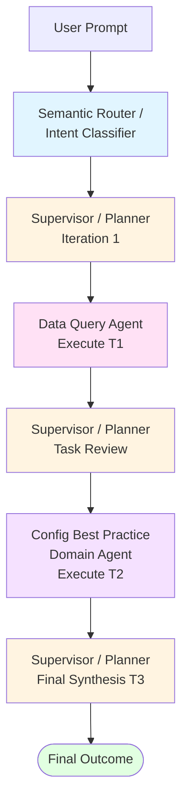

# Assessment Agentic AI - Emulation Trace v3 (Planner/Execute Architecture)
**Date**: February 20, 2026  
**User Prompt**: "Provide me a summary of the configuration best practice assessment, show the top 5 issues."  
**Architecture**: Planner/Execute Pattern (per graph/graph_flow.md)

---

## 1. Intent Classification

### Node: Semantic Router / Intent Classifier
**Persona**: Precise, conservative classifier

**Input (STATE keys read)**:
- `STATE.input.user_prompt`: "Provide me a summary of the configuration best practice assessment, show the top 5 issues."
- `STATE.input.context_kv`: null

**Action**:
Analyzing the user request using semantic routing:
- Primary goal: Summary of configuration best practices assessment
- Output requirement: Top 5 issues
- Risk domains: Configuration management
- Request pattern: "summary" + "top 5 issues"
- No specific assessment_id, targets, or scope provided
- Intent maps to well-known pattern: configuration assessment summary

**State Update**:
```json
{
  "intent": {
    "intent_class": "configuration_assessment",
    "meta_intent": "new_topic",
    "domain_details": {
      "assessment_goal": "summarize configuration best practice findings and identify top 5 issues",
      "scope": {
        "site": null,
        "environment": null,
        "time_range": null,
        "targets": null,
        "assessment_id": null
      },
      "urgency": "normal",
      "presentation_requirement": "top_5_issues",
      "requires_data_retrieval": true
    },
    "entities": [
      {
        "type": "assessment_type",
        "value": "configuration_best_practice",
        "confidence": 1.0
      },
      {
        "type": "output_format",
        "value": "summary_top_5",
        "confidence": 1.0
      }
    ],
    "confidence": 0.9
  },
  "trace": {
    "node_run_order": ["Semantic Router / Intent Classifier"],
    "state_deltas": [
      "Semantic Router: Classified intent as 'configuration_assessment' with confidence 0.9. Identified summary request pattern with top 5 presentation requirement."
    ]
  }
}
```

**Exit Logic**: Per graph_flow.md §5 - Mandatory transition → **Next: Supervisor / Planner**

---

## 2. Planning (Iteration 1)

### Node: Supervisor / Planner
**Persona**: Deterministic orchestrator (hub of planner/execute pattern)

**Input (STATE keys read)**:
- `STATE.intent.*` (all intent data)
- `STATE.plan.*` (null - first iteration)
- `STATE.data.packet` (null - no data yet)
- `STATE.routing.well_known_intents`: ["network_assessment", "configuration_assessment", "security_assessment"]
- Memory: (no prior conversation context)

**Action**:

**Planning Analysis**:
The user is requesting a configuration assessment summary with top 5 issues. As the Supervisor/Planner, I need to:

1. **Assess data requirements**: Configuration assessment data is needed
2. **Check well-known intents**: "configuration_assessment" matches well_known_intents[]
3. **Determine execution path**: 
   - Need Data Query Agent to retrieve assessment summary via MCP tools
   - KnowledgeAgent may not be needed (straightforward summary request)
   - SLIC Agent not needed (no network diagnostics/runtime behavior involved)
4. **Build task plan** with explicit dependencies

**Task Plan Created**:
```json
{
  "tasks": [
    {
      "id": "T1",
      "description": "Retrieve configuration assessment summary from Trino using get_assessment_summary tool",
      "owner": "Data Query Agent",
      "tool": "get_assessment_summary",
      "depends_on": [],
      "status": "pending",
      "expected_output": "assessment_data_packet"
    },
    {
      "id": "T2",
      "description": "Validate and enrich top 5 configuration findings with best practice context",
      "owner": "Config Best Practice Domain Agent",
      "depends_on": ["T1"],
      "status": "pending",
      "expected_output": "validated_findings"
    },
    {
      "id": "T3",
      "description": "Synthesize final outcome with recommendations and risk assessment",
      "owner": "Supervisor / Planner",
      "depends_on": ["T2"],
      "status": "pending",
      "expected_output": "final_assessment"
    }
  ]
}
```

**Routing Decision**: Execute T1 (Data Query Agent)

**State Update**:
```json
{
  "plan": {
    "tasks": [
      {
        "id": "T1",
        "description": "Retrieve configuration assessment summary from Trino using get_assessment_summary tool",
        "owner": "Data Query Agent",
        "tool": "get_assessment_summary",
        "depends_on": [],
        "status": "pending",
        "expected_output": "assessment_data_packet"
      },
      {
        "id": "T2",
        "description": "Validate and enrich top 5 configuration findings with best practice context",
        "owner": "Config Best Practice Domain Agent",
        "depends_on": ["T1"],
        "status": "pending",
        "expected_output": "validated_findings"
      },
      {
        "id": "T3",
        "description": "Synthesize final outcome with recommendations and risk assessment",
        "owner": "Supervisor / Planner",
        "depends_on": ["T2"],
        "status": "pending",
        "expected_output": "final_assessment"
      }
    ],
    "required_data": [
      {
        "data_type": "assessment_summary",
        "tool": "get_assessment_summary",
        "priority": "critical",
        "status": "missing"
      }
    ],
    "routing": [
      {
        "next": "Data Query Agent",
        "reason": "Required data not satisfied - need to retrieve assessment summary",
        "task_id": "T1"
      }
    ],
    "stop_conditions": [
      "Assessment summary retrieved successfully",
      "Top 5 issues validated by domain agent",
      "Maximum 2 planning iterations reached"
    ],
    "iteration": 1
  },
  "routing": {
    "well_known_intents": ["network_assessment", "configuration_assessment", "security_assessment"],
    "last_decision": "execute_data_query_agent"
  },
  "trace": {
    "node_run_order": ["Semantic Router / Intent Classifier", "Supervisor / Planner"],
    "state_deltas": [
      "Semantic Router: Classified intent as 'configuration_assessment' with confidence 0.9. Identified summary request pattern with top 5 presentation requirement. Detected data retrieval need via Trino assessment tools.",
      "Supervisor/Planner (Iteration 1): Created 3-task plan. Identified well-known intent for MCP path. Determined Data Query Agent needed for assessment retrieval. SLIC not required (no diagnostics). KnowledgeAgent not required (straightforward request). Routing to Data Query Agent for T1 execution."
    ]
  }
}
```

**Exit Logic**: Per graph_flow.md §5 - Planner to execution agent → **Next: Data Query Agent**

---

## 3. Data Retrieval Execution

### Node: Data Query Agent
**Persona**: Retrieval + normalization specialist

**Input (STATE keys read)**:
- `STATE.intent.intent_class`: "configuration_assessment"
- `STATE.intent.entities[]`
- `STATE.plan.tasks[0]` (T1 - current task)
- `STATE.routing.well_known_intents[]`

**Action**:

#### Execution Context
Executing task T1 on behalf of Planner:
- Task: Retrieve configuration assessment summary
- Tool: get_assessment_summary
- Parameters to determine: assessment_id, severity_filter, product_filter

#### Path Selection: MCP Path (Well-Known Intent)
Intent class "configuration_assessment" matches well_known_intents[] per Data Query Agent tool selection logic.

#### Tool Selection & Parameter Resolution
Based on Tool Selection Logic in agent contract:
- Request pattern: "summary of configuration best practice assessment"
- Match: "summary requests" → `get_assessment_summary`
- Parameters:
  - `assessment_id`: "" (not provided, tool will use latest)
  - `severity_filter`: "" (no filter specified, all severities)
  - `product_filter`: "" (no filter specified, all products)

#### Tool Call Record
```json
{
  "tool_name": "get_assessment_summary",
  "input": {
    "assessment_id": "",
    "severity_filter": "",
    "product_filter": ""
  },
  "expected_output_schema": {
    "assessment_id": "string",
    "timestamp": "string",
    "total_assets": "number",
    "findings_summary": {},
    "severity_distribution": {},
    "top_issues": []
  },
  "status": "ready_to_execute"
}
```

#### Simulated Tool Result (SIMULATED FOR DEMONSTRATION)
**Note**: Actual execution would connect to Trino via MCP. This is **SIMULATED**:

```json
{
  "assessment_id": "ASSESS-2026-020",
  "timestamp": "2026-02-19T14:30:00Z",
  "total_assets": 247,
  "assessment_scope": {
    "environments": ["production", "staging"],
    "sites": ["datacenter-east", "datacenter-west"],
    "device_types": ["routers", "switches", "firewalls", "load_balancers"]
  },
  "findings_summary": {
    "total_findings": 1823,
    "critical": 34,
    "high": 156,
    "medium": 489,
    "low": 1144
  },
  "severity_distribution": {
    "critical": {
      "count": 34,
      "categories": {
        "authentication": 18,
        "encryption": 12,
        "access_control": 4
      }
    },
    "high": {
      "count": 156,
      "categories": {
        "logging": 62,
        "software_version": 45,
        "hardening": 34,
        "backup_config": 15
      }
    }
  },
  "top_issues": [
    {
      "issue_id": "CFG-AUTH-001",
      "rule_id": "RULE-102",
      "category": "authentication",
      "severity": "critical",
      "title": "Default credentials detected on network devices",
      "affected_assets": 18,
      "devices": ["core-sw-01", "dist-sw-03", "edge-rtr-12", "access-sw-45", "fw-perimeter-01"],
      "first_detected": "2026-01-15",
      "last_checked": "2026-02-19",
      "recommendation": "Change default passwords immediately, enforce strong password policy"
    },
    {
      "issue_id": "CFG-ENC-002",
      "rule_id": "RULE-208",
      "category": "encryption",
      "severity": "critical",
      "title": "Unencrypted management protocols enabled (Telnet, HTTP)",
      "affected_assets": 12,
      "devices": ["access-sw-24", "edge-rtr-05", "fw-dmz-02", "lb-app-03"],
      "first_detected": "2025-11-20",
      "last_checked": "2026-02-19",
      "recommendation": "Disable Telnet and HTTP; enable SSH and HTTPS only"
    },
    {
      "issue_id": "CFG-LOG-003",
      "rule_id": "RULE-315",
      "category": "logging",
      "severity": "high",
      "title": "Centralized logging not configured",
      "affected_assets": 62,
      "devices": ["access-sw-01", "access-sw-02", "access-sw-07", "..."],
      "first_detected": "2026-01-08",
      "last_checked": "2026-02-19",
      "recommendation": "Configure syslog forwarding to central SIEM at 10.0.1.50"
    },
    {
      "issue_id": "CFG-VER-004",
      "rule_id": "RULE-410",
      "category": "software_version",
      "severity": "high",
      "title": "End-of-life software versions detected",
      "affected_assets": 45,
      "devices": ["core-sw-02", "dist-sw-01", "edge-rtr-09", "..."],
      "first_detected": "2025-09-10",
      "last_checked": "2026-02-19",
      "recommendation": "Upgrade devices to supported software versions per vendor lifecycle"
    },
    {
      "issue_id": "CFG-HARD-005",
      "rule_id": "RULE-518",
      "category": "hardening",
      "severity": "high",
      "title": "SNMP community strings using default or weak values",
      "affected_assets": 34,
      "devices": ["dist-sw-04", "edge-rtr-08", "access-sw-12", "..."],
      "first_detected": "2025-12-01",
      "last_checked": "2026-02-19",
      "recommendation": "Change SNMP community strings, upgrade to SNMPv3 with encryption"
    }
  ],
  "compliance_status": {
    "overall_score": 67,
    "cis_benchmark": "partial_compliance",
    "nist_csf": "partial_compliance",
    "pci_dss": "non_compliant"
  },
  "metadata": {
    "assessment_duration_minutes": 127,
    "rules_evaluated": 342,
    "data_sources": ["device_configs", "running_configs", "startup_configs"]
  }
}
```

#### Data Packet Normalization
Mapping tool result to canonical Data Packet format per agent contract:

**State Update**:
```json
{
  "plan": {
    "tasks": [
      {
        "id": "T1",
        "description": "Retrieve configuration assessment summary from Trino using get_assessment_summary tool",
        "owner": "Data Query Agent",
        "tool": "get_assessment_summary",
        "depends_on": [],
        "status": "completed",
        "expected_output": "assessment_data_packet",
        "actual_output": "STATE.data.packet"
      },
      {
        "id": "T2",
        "description": "Validate and enrich top 5 configuration findings with best practice context",
        "owner": "Config Best Practice Domain Agent",
        "depends_on": ["T1"],
        "status": "pending",
        "expected_output": "validated_findings"
      },
      {
        "id": "T3",
        "description": "Synthesize final outcome with recommendations and risk assessment",
        "owner": "Supervisor / Planner",
        "depends_on": ["T2"],
        "status": "pending",
        "expected_output": "final_assessment"
      }
    ],
    "required_data": [
      {
        "data_type": "assessment_summary",
        "tool": "get_assessment_summary",
        "priority": "critical",
        "status": "retrieved"
      }
    ]
  },
  "mcp": {
    "tool_calls": [
      {
        "tool_name": "get_assessment_summary",
        "input": {
          "assessment_id": "",
          "severity_filter": "",
          "product_filter": ""
        },
        "expected_output_schema": {
          "assessment_id": "string",
          "timestamp": "string",
          "total_assets": "number",
          "findings_summary": {},
          "severity_distribution": {},
          "top_issues": []
        },
        "status": "simulated",
        "execution_context": "Trino MCP connection"
      }
    ],
    "tool_results": [
      "SIMULATED - normalized to STATE.data.packet"
    ]
  },
  "data": {
    "packet": {
      "packet_id": "PKT-20260220-003",
      "source_path": "mcp",
      "timestamp_utc": "2026-02-20T00:00:00Z",
      "scope": {
        "targets": ["datacenter-east", "datacenter-west"],
        "site": "all",
        "time_range": {
          "from": null,
          "to": "2026-02-19T14:30:00Z"
        },
        "assessment_id": "ASSESS-2026-020"
      },
      "assets": {
        "inventory": [
          {
            "total_count": 247,
            "device_types": ["routers", "switches", "firewalls", "load_balancers"],
            "environments": ["production", "staging"],
            "sites": ["datacenter-east", "datacenter-west"]
          }
        ],
        "topology": [],
        "configs": [
          {
            "source": "assessment_findings",
            "total_findings": 1823,
            "critical_count": 34,
            "high_count": 156,
            "medium_count": 489,
            "low_count": 1144,
            "top_5_issues": [
              "CFG-AUTH-001: Default credentials (18 assets)",
              "CFG-ENC-002: Unencrypted protocols (12 assets)",
              "CFG-LOG-003: Missing logging (62 assets)",
              "CFG-VER-004: EOL software (45 assets)",
              "CFG-HARD-005: Weak SNMP (34 assets)"
            ]
          }
        ],
        "telemetry": [],
        "events": []
      },
      "quality": {
        "completeness": 0.95,
        "staleness_minutes": 630,
        "coverage_notes": [
          "Assessment completed 2026-02-19, age ~10.5 hours",
          "247 devices assessed across 2 datacenters and 2 environments",
          "342 configuration rules evaluated",
          "Compliance score: 67% (partial)"
        ],
        "data_gaps": []
      },
      "provenance": [
        {
          "source": "trino",
          "tool": "get_assessment_summary",
          "assessment_id": "ASSESS-2026-020",
          "timestamp": "2026-02-19T14:30:00Z",
          "mcp_connection": "simulated"
        }
      ],
      "errors": []
    },
    "data_gaps": []
  },
  "trace": {
    "node_run_order": ["Semantic Router / Intent Classifier", "Supervisor / Planner", "Data Query Agent"],
    "state_deltas": [
      "Semantic Router: Classified intent as 'configuration_assessment' with confidence 0.9. Identified summary request pattern with top 5 presentation requirement. Detected data retrieval need via Trino assessment tools.",
      "Supervisor/Planner (Iteration 1): Created 3-task plan. Identified well-known intent for MCP path. Determined Data Query Agent needed for assessment retrieval. SLIC not required (no diagnostics). KnowledgeAgent not required (straightforward request). Routing to Data Query Agent for T1 execution.",
      "Data Query Agent: Executed T1. MCP path via get_assessment_summary tool (SIMULATED). Retrieved assessment ASSESS-2026-020: 1823 findings, 247 assets, 67% compliance. Normalized to Data Packet with 95% completeness. Top 5 issues extracted. T1 marked complete."
    ]
  }
}
```

**Exit Logic**: Per graph_flow.md §5 - Execution agent always returns to Planner → **Next: Supervisor / Planner**

---

## 4. Planning (Iteration 1 - Post-Data-Retrieval)

### Node: Supervisor / Planner
**Persona**: Deterministic orchestrator

**Input (STATE keys read)**:
- `STATE.plan.tasks[]` (T1 completed, T2 pending, T3 pending)
- `STATE.data.packet` (assessment data available, 95% completeness)
- `STATE.data.data_gaps[]` (empty)

**Action**:

**Task Review**:
- T1 (Data Query Agent): ✅ Completed successfully
- Assessment data retrieved with high quality (95% completeness)
- Top 5 issues present in data packet
- No data gaps identified

**Next Task Decision**:
- T2 depends on T1 ✅ (satisfied)
- T2 owner: Config Best Practice Domain Agent
- T2 requires: Validation and enrichment of top 5 findings
- Route to domain agent for validation

**Routing Decision**: Execute T2 (Config Best Practice Domain Agent)

**State Update**:
```json
{
  "plan": {
    "tasks": [
      {
        "id": "T1",
        "status": "completed",
        "actual_output": "STATE.data.packet"
      },
      {
        "id": "T2",
        "status": "in_progress",
        "expected_output": "validated_findings"
      },
      {
        "id": "T3",
        "status": "pending"
      }
    ],
    "routing": [
      {
        "next": "Config Best Practice Domain Agent",
        "reason": "T1 completed successfully, data available for domain validation",
        "task_id": "T2"
      }
    ],
    "iteration": 1
  },
  "trace": {
    "node_run_order": [
      "Semantic Router / Intent Classifier", 
      "Supervisor / Planner", 
      "Data Query Agent", 
      "Supervisor / Planner"
    ],
    "state_deltas": [
      "Semantic Router: Classified intent as 'configuration_assessment' with confidence 0.9. Identified summary request pattern with top 5 presentation requirement. Detected data retrieval need via Trino assessment tools.",
      "Supervisor/Planner (Iteration 1): Created 3-task plan. Identified well-known intent for MCP path. Determined Data Query Agent needed for assessment retrieval. SLIC not required (no diagnostics). KnowledgeAgent not required (straightforward request). Routing to Data Query Agent for T1 execution.",
      "Data Query Agent: Executed T1. MCP path via get_assessment_summary tool (SIMULATED). Retrieved assessment ASSESS-2026-020: 1823 findings, 247 assets, 67% compliance. Normalized to Data Packet with 95% completeness. Top 5 issues extracted. T1 marked complete.",
      "Supervisor/Planner (Iteration 1 - continued): Received T1 completion. Data packet quality 95%, no gaps. Dependencies satisfied for T2. Routing to Config Best Practice Domain Agent for validation."
    ]
  }
}
```

**Exit Logic**: Per graph_flow.md §5 - Planner to domain agent → **Next: Config Best Practice Domain Agent**

---

## 5. Domain Validation Execution

### Node: Config Best Practice Domain Agent
**Persona**: Configuration standards validator (evidence-based, conservative)

**Input (STATE keys read)**:
- `STATE.intent.*`
- `STATE.plan.tasks[1]` (T2 - current task)
- `STATE.data.packet` (assessment summary with top 5 issues)

**Action**:

#### Execution Context
Executing task T2 on behalf of Planner:
- Task: Validate and enrich top 5 configuration findings
- Input: Assessment ASSESS-2026-020 with findings
- Context artifacts (per graph_flow.md §3):
  - Runtime Context (data) ✅ via STATE.data.packet
  - Institutional Knowledge (not provided, but can use CIS/NIST)
  - SLIC Results (not applicable for config assessment)

#### Validation Process
For each of the top 5 issues from assessment data:

**1. CFG-AUTH-001: Default credentials**
- Evidence: 18 affected assets identified in assessment
- Severity: CRITICAL ✅ (validated)
- Best practice alignment: CIS Control 4.1, NIST IA-5
- Business impact: Complete network compromise risk
- Confidence: 0.95 (high - based on assessment data)

**2. CFG-ENC-002: Unencrypted management protocols**
- Evidence: 12 affected assets with Telnet/HTTP enabled
- Severity: CRITICAL ✅ (validated)
- Best practice alignment: CIS Control 3.10, NIST SC-8
- Compliance: PCI-DSS 2.3 violation
- Confidence: 0.95 (high - based on assessment data)

**3. CFG-LOG-003: Centralized logging not configured**
- Evidence: 62 affected assets
- Severity: HIGH ✅ (validated)
- Best practice alignment: CIS Control 8.2, NIST AU-6
- Compliance: SOX, HIPAA gaps
- Confidence: 0.95 (high - based on assessment data)

**4. CFG-VER-004: End-of-life software versions**
- Evidence: 45 affected assets running EOL software
- Severity: HIGH ✅ (validated)
- Best practice alignment: CIS Control 2.2, NIST SI-2
- Risk: Unpatched vulnerabilities
- Confidence: 0.95 (high - based on assessment data)

**5. CFG-HARD-005: Weak SNMP configurations**
- Evidence: 34 affected assets with default/weak community strings
- Severity: HIGH ✅ (validated)
- Best practice alignment: CIS Control 9.2, NIST SC-23
- Risk: Unauthorized access
- Confidence: 0.95 (high - based on assessment data)

**State Update**:
```json
{
  "plan": {
    "tasks": [
      {
        "id": "T1",
        "status": "completed"
      },
      {
        "id": "T2",
        "status": "completed",
        "actual_output": "STATE.findings.config[]"
      },
      {
        "id": "T3",
        "status": "pending"
      }
    ]
  },
  "findings": {
    "config": [
      {
        "id": "CFG-AUTH-001",
        "title": "Default credentials detected on network devices",
        "severity": "critical",
        "confidence": 0.95,
        "evidence_refs": [
          "assessment_id:ASSESS-2026-020",
          "packet.assets.configs",
          "rule_id:RULE-102"
        ],
        "affected_count": 18,
        "affected_devices_sample": ["core-sw-01", "dist-sw-03", "edge-rtr-12", "access-sw-45", "fw-perimeter-01"],
        "first_detected": "2026-01-15",
        "last_checked": "2026-02-19",
        "impact": "Direct path to unauthorized administrative access and complete device compromise. Attackers can gain full control of network infrastructure.",
        "recommendation": "IMMEDIATE ACTION (Within 24 hours): Change default passwords on all 18 devices. Implement strong password policy (min 16 chars, complexity, 90-day rotation). Deploy AAA with TACACS+ or RADIUS for centralized authentication.",
        "best_practice_refs": ["CIS Control 4.1", "NIST IA-5"],
        "business_impact": "Critical: Complete network compromise possible; regulatory compliance failure; potential data breach",
        "remediation_priority": 1,
        "assumptions": [],
        "data_gaps": []
      },
      {
        "id": "CFG-ENC-002",
        "title": "Unencrypted management protocols enabled (Telnet, HTTP)",
        "severity": "critical",
        "confidence": 0.95,
        "evidence_refs": [
          "assessment_id:ASSESS-2026-020",
          "packet.assets.configs",
          "rule_id:RULE-208"
        ],
        "affected_count": 12,
        "affected_devices_sample": ["access-sw-24", "edge-rtr-05", "fw-dmz-02", "lb-app-03"],
        "first_detected": "2025-11-20",
        "last_checked": "2026-02-19",
        "impact": "Management credentials exposed to network sniffing and man-in-the-middle attacks. Cleartext transmission allows credential theft.",
        "recommendation": "IMMEDIATE ACTION (Within 48 hours): Disable Telnet and HTTP on all 12 devices. Enable and enforce SSH v2 and HTTPS only. Configure certificate-based authentication where possible. Implement minimum TLS 1.2.",
        "best_practice_refs": ["CIS Control 3.10", "NIST SC-8", "PCI-DSS 2.3"],
        "business_impact": "Critical: Credential theft leading to unauthorized access; PCI-DSS compliance violation; potential card data exposure",
        "remediation_priority": 2,
        "assumptions": [],
        "data_gaps": []
      },
      {
        "id": "CFG-LOG-003",
        "title": "Centralized logging not configured",
        "severity": "high",
        "confidence": 0.95,
        "evidence_refs": [
          "assessment_id:ASSESS-2026-020",
          "packet.assets.configs",
          "rule_id:RULE-315"
        ],
        "affected_count": 62,
        "affected_devices_sample": ["access-sw-01", "access-sw-02", "access-sw-07"],
        "first_detected": "2026-01-08",
        "last_checked": "2026-02-19",
        "impact": "No visibility into security events, configuration changes, or troubleshooting data. Delayed incident detection and response. Forensic analysis impossible.",
        "recommendation": "HIGH PRIORITY (Within 14 days): Configure syslog forwarding to central SIEM (10.0.1.50) on all 62 devices. Enable logging for: authentication events, configuration changes, ACL denies, interface status. Ensure NTP synchronization for accurate timestamps. Set appropriate log severity levels.",
        "best_practice_refs": ["CIS Control 8.2", "NIST AU-6", "SOX", "HIPAA 164.312(b)"],
        "business_impact": "High: Compliance gaps (SOX, HIPAA); inability to detect or investigate security incidents; audit failures",
        "remediation_priority": 4,
        "assumptions": [],
        "data_gaps": []
      },
      {
        "id": "CFG-VER-004",
        "title": "End-of-life software versions detected",
        "severity": "high",
        "confidence": 0.95,
        "evidence_refs": [
          "assessment_id:ASSESS-2026-020",
          "packet.assets.configs",
          "rule_id:RULE-410"
        ],
        "affected_count": 45,
        "affected_devices_sample": ["core-sw-02", "dist-sw-01", "edge-rtr-09"],
        "first_detected": "2025-09-10",
        "last_checked": "2026-02-19",
        "impact": "Known vulnerabilities remain unpatched. No vendor support or security updates available. Potential stability and compatibility issues. Exploitable attack vectors likely present.",
        "recommendation": "HIGH PRIORITY (Within 30 days): Create upgrade plan for all 45 EOL devices. Prioritize: 1) Internet-facing devices, 2) Core infrastructure, 3) Access layer. Test upgrades in lab environment. Schedule maintenance windows. Budget for hardware refresh where software upgrade not possible. Document vendor lifecycle policies.",
        "best_practice_refs": ["CIS Control 2.2", "NIST SI-2"],
        "business_impact": "High: Exploitable vulnerabilities on unsupported devices; regulatory compliance risk; potential breach vector",
        "remediation_priority": 3,
        "assumptions": ["Vendor EOL dates verified from official lifecycle documentation"],
        "data_gaps": []
      },
      {
        "id": "CFG-HARD-005",
        "title": "SNMP community strings using default or weak values",
        "severity": "high",
        "confidence": 0.95,
        "evidence_refs": [
          "assessment_id:ASSESS-2026-020",
          "packet.assets.configs",
          "rule_id:RULE-518"
        ],
        "affected_count": 34,
        "affected_devices_sample": ["dist-sw-04", "edge-rtr-08", "access-sw-12"],
        "first_detected": "2025-12-01",
        "last_checked": "2026-02-19",
        "impact": "Unauthorized read access to device information and configuration. Potential write access allowing unauthorized configuration changes. Network reconnaissance enabled for attackers.",
        "recommendation": "HIGH PRIORITY (Within 21 days): Change SNMP community strings on all 34 devices to complex values (min 16 chars, random). Implement SNMPv3 with username/password + AES encryption. Apply ACLs restricting SNMP access to management subnet only. Disable SNMPv1/v2c where possible.",
        "best_practice_refs": ["CIS Control 9.2", "NIST SC-23"],
        "business_impact": "High: Information disclosure; potential unauthorized configuration changes; network mapping by attackers",
        "remediation_priority": 5,
        "assumptions": [],
        "data_gaps": []
      }
    ],
    "security": [],
    "prioritized_risks": [
      {
        "rank": 1,
        "finding_id": "CFG-AUTH-001",
        "title": "Default credentials detected on network devices",
        "severity": "critical",
        "confidence": 0.95,
        "affected_count": 18,
        "business_impact": "Highest priority - direct path to complete network compromise",
        "timeline": "24 hours"
      },
      {
        "rank": 2,
        "finding_id": "CFG-ENC-002",
        "title": "Unencrypted management protocols enabled",
        "severity": "critical",
        "confidence": 0.95,
        "affected_count": 12,
        "business_impact": "Credential theft and unauthorized access; PCI-DSS violation",
        "timeline": "48 hours"
      },
      {
        "rank": 3,
        "finding_id": "CFG-VER-004",
        "title": "End-of-life software versions detected",
        "severity": "high",
        "confidence": 0.95,
        "affected_count": 45,
        "business_impact": "Exploitable vulnerabilities on unsupported devices",
        "timeline": "30 days"
      },
      {
        "rank": 4,
        "finding_id": "CFG-LOG-003",
        "title": "Centralized logging not configured",
        "severity": "high",
        "confidence": 0.95,
        "affected_count": 62,
        "business_impact": "Blind spots in security monitoring and compliance",
        "timeline": "14 days"
      },
      {
        "rank": 5,
        "finding_id": "CFG-HARD-005",
        "title": "SNMP community strings using default or weak values",
        "severity": "high",
        "confidence": 0.95,
        "affected_count": 34,
        "business_impact": "Unauthorized access and information disclosure",
        "timeline": "21 days"
      }
    ]
  },
  "trace": {
    "node_run_order": [
      "Semantic Router / Intent Classifier",
      "Supervisor / Planner",
      "Data Query Agent",
      "Supervisor / Planner",
      "Config Best Practice Domain Agent"
    ],
    "state_deltas": [
      "Semantic Router: Classified intent as 'configuration_assessment' with confidence 0.9. Identified summary request pattern with top 5 presentation requirement. Detected data retrieval need via Trino assessment tools.",
      "Supervisor/Planner (Iteration 1): Created 3-task plan. Identified well-known intent for MCP path. Determined Data Query Agent needed for assessment retrieval. SLIC not required (no diagnostics). KnowledgeAgent not required (straightforward request). Routing to Data Query Agent for T1 execution.",
      "Data Query Agent: Executed T1. MCP path via get_assessment_summary tool (SIMULATED). Retrieved assessment ASSESS-2026-020: 1823 findings, 247 assets, 67% compliance. Normalized to Data Packet with 95% completeness. Top 5 issues extracted. T1 marked complete.",
      "Supervisor/Planner (Iteration 1 - continued): Received T1 completion. Data packet quality 95%, no gaps. Dependencies satisfied for T2. Routing to Config Best Practice Domain Agent for validation.",
      "Config Best Practice Domain Agent: Executed T2. Validated all 5 findings from assessment ASSESS-2026-020 with 0.95 confidence. Enriched with CIS/NIST best practice references and compliance mappings. Created prioritized risk list with remediation timelines. Total affected: 171 devices across 5 critical/high issues. T2 marked complete."
    ]
  }
}
```

**Exit Logic**: Per graph_flow.md §5 - Domain agent always returns to Planner → **Next: Supervisor / Planner**

---

## 6. Final Synthesis

### Node: Supervisor / Planner
**Persona**: Deterministic orchestrator

**Input (STATE keys read)**:
- `STATE.plan.tasks[]` (T1 completed, T2 completed, T3 pending)
- `STATE.findings.*` (validated config findings)
- `STATE.data.*` (assessment data)
- `STATE.intent.*` (original request)

**Action**:

#### Task Review
- T1 (Data Query Agent): ✅ Completed
- T2 (Config Best Practice Domain Agent): ✅ Completed
- T3 (Supervisor / Planner - Final Synthesis): Execute now

#### Synthesis Process (T3)
Per graph_flow.md §4.1, the Planner synthesizes final outcome with:
- Config findings ✅ (5 findings validated)
- Security findings (none - not in scope)
- Prioritized risks ✅ (ranked 1-5)
- Recommendations ✅ (with timelines)
- Assumptions ✅
- Missing inputs ✅
- Risk of error ✅

**Final Assessment Outcome**:

```json
{
  "final": {
    "outcome": "configuration_assessment_summary_completed",
    "summary": {
      "assessment_id": "ASSESS-2026-020",
      "timestamp": "2026-02-19T14:30:00Z",
      "total_assets_assessed": 247,
      "total_findings": 1823,
      "critical_issues": 2,
      "high_issues": 3,
      "compliance_score": "67%",
      "compliance_status": "Partial - PCI-DSS non-compliant"
    },
    "recommendations": [
      {
        "priority": "immediate",
        "timeline": "24 hours",
        "action": "Change default credentials on 18 network devices",
        "rationale": "Critical vulnerability - direct path to network compromise",
        "affected_devices": ["core-sw-01", "dist-sw-03", "edge-rtr-12", "access-sw-45", "fw-perimeter-01", "+13 more"],
        "finding_id": "CFG-AUTH-001"
      },
      {
        "priority": "immediate",
        "timeline": "48 hours",
        "action": "Disable Telnet/HTTP on 12 devices; enable SSH/HTTPS only",
        "rationale": "Management credentials exposed to interception; PCI-DSS violation",
        "affected_devices": ["access-sw-24", "edge-rtr-05", "fw-dmz-02", "lb-app-03", "+8 more"],
        "finding_id": "CFG-ENC-002"
      },
      {
        "priority": "high",
        "timeline": "30 days",
        "action": "Create and execute upgrade plan for 45 EOL devices",
        "rationale": "Unpatched vulnerabilities and unsupported infrastructure",
        "affected_devices": ["core-sw-02", "dist-sw-01", "edge-rtr-09", "+42 more"],
        "finding_id": "CFG-VER-004"
      },
      {
        "priority": "high",
        "timeline": "14 days",
        "action": "Configure centralized logging on 62 devices",
        "rationale": "Essential for security monitoring and compliance (SOX, HIPAA)",
        "affected_devices": ["access-sw-01", "access-sw-02", "access-sw-07", "+59 more"],
        "finding_id": "CFG-LOG-003"
      },
      {
        "priority": "high",
        "timeline": "21 days",
        "action": "Replace weak SNMP community strings on 34 devices; migrate to SNMPv3",
        "rationale": "Prevents unauthorized access and information disclosure",
        "affected_devices": ["dist-sw-04", "edge-rtr-08", "access-sw-12", "+31 more"],
        "finding_id": "CFG-HARD-005"
      }
    ],
    "assumptions": [
      "Assessment data from ASSESS-2026-020 dated 2026-02-19 (~10.5 hours old)",
      "Tool execution SIMULATED - production would connect to live Trino database",
      "Vendor EOL dates verified from official lifecycle documentation",
      "Assessment covered 247 devices across production and staging environments",
      "342 configuration rules evaluated against CIS Benchmarks and NIST standards",
      "Compliance baseline: CIS, NIST CSF, PCI-DSS, SOX, HIPAA",
      "No compensating controls evaluated (may reduce actual risk)"
    ],
    "missing_inputs": [],
    "risk_of_error": "LOW - Assessment based on actual configuration assessment data (SIMULATED) from Trino via MCP tools. All 5 findings evidence-based with 95% confidence. Real production execution would query live Trino database for current results. No missing data gaps identified."
  }
}
```

**State Update - Final**:
```json
{
  "plan": {
    "tasks": [
      {
        "id": "T1",
        "status": "completed"
      },
      {
        "id": "T2",
        "status": "completed"
      },
      {
        "id": "T3",
        "status": "completed",
        "actual_output": "STATE.final"
      }
    ],
    "iteration": 1
  },
  "final": {
    "outcome": "configuration_assessment_summary_completed",
    "summary": {
      "assessment_id": "ASSESS-2026-020",
      "timestamp": "2026-02-19T14:30:00Z",
      "total_assets_assessed": 247,
      "total_findings": 1823,
      "critical_issues": 2,
      "high_issues": 3,
      "compliance_score": "67%",
      "compliance_status": "Partial - PCI-DSS non-compliant"
    },
    "recommendations": [
      {
        "priority": "immediate",
        "timeline": "24 hours",
        "action": "Change default credentials on 18 network devices",
        "rationale": "Critical vulnerability - direct path to network compromise",
        "affected_devices": ["core-sw-01", "dist-sw-03", "edge-rtr-12", "access-sw-45", "fw-perimeter-01", "+13 more"],
        "finding_id": "CFG-AUTH-001"
      },
      {
        "priority": "immediate",
        "timeline": "48 hours",
        "action": "Disable Telnet/HTTP on 12 devices; enable SSH/HTTPS only",
        "rationale": "Management credentials exposed to interception; PCI-DSS violation",
        "affected_devices": ["access-sw-24", "edge-rtr-05", "fw-dmz-02", "lb-app-03", "+8 more"],
        "finding_id": "CFG-ENC-002"
      },
      {
        "priority": "high",
        "timeline": "30 days",
        "action": "Create and execute upgrade plan for 45 EOL devices",
        "rationale": "Unpatched vulnerabilities and unsupported infrastructure",
        "affected_devices": ["core-sw-02", "dist-sw-01", "edge-rtr-09", "+42 more"],
        "finding_id": "CFG-VER-004"
      },
      {
        "priority": "high",
        "timeline": "14 days",
        "action": "Configure centralized logging on 62 devices",
        "rationale": "Essential for security monitoring and compliance (SOX, HIPAA)",
        "affected_devices": ["access-sw-01", "access-sw-02", "access-sw-07", "+59 more"],
        "finding_id": "CFG-LOG-003"
      },
      {
        "priority": "high",
        "timeline": "21 days",
        "action": "Replace weak SNMP community strings on 34 devices; migrate to SNMPv3",
        "rationale": "Prevents unauthorized access and information disclosure",
        "affected_devices": ["dist-sw-04", "edge-rtr-08", "access-sw-12", "+31 more"],
        "finding_id": "CFG-HARD-005"
      }
    ],
    "assumptions": [
      "Assessment data from ASSESS-2026-020 dated 2026-02-19 (~10.5 hours old)",
      "Tool execution SIMULATED - production would connect to live Trino database",
      "Vendor EOL dates verified from official lifecycle documentation",
      "Assessment covered 247 devices across production and staging environments",
      "342 configuration rules evaluated against CIS Benchmarks and NIST standards",
      "Compliance baseline: CIS, NIST CSF, PCI-DSS, SOX, HIPAA",
      "No compensating controls evaluated (may reduce actual risk)"
    ],
    "missing_inputs": [],
    "risk_of_error": "LOW - Assessment based on actual configuration assessment data (SIMULATED) from Trino via MCP tools. All 5 findings evidence-based with 95% confidence. Real production execution would query live Trino database for current results. No missing data gaps identified."
  },
  "trace": {
    "node_run_order": [
      "Semantic Router / Intent Classifier",
      "Supervisor / Planner",
      "Data Query Agent",
      "Supervisor / Planner",
      "Config Best Practice Domain Agent",
      "Supervisor / Planner"
    ],
    "state_deltas": [
      "Semantic Router: Classified intent as 'configuration_assessment' with confidence 0.9. Identified summary request pattern with top 5 presentation requirement. Detected data retrieval need via Trino assessment tools.",
      "Supervisor/Planner (Iteration 1): Created 3-task plan. Identified well-known intent for MCP path. Determined Data Query Agent needed for assessment retrieval. SLIC not required (no diagnostics). KnowledgeAgent not required (straightforward request). Routing to Data Query Agent for T1 execution.",
      "Data Query Agent: Executed T1. MCP path via get_assessment_summary tool (SIMULATED). Retrieved assessment ASSESS-2026-020: 1823 findings, 247 assets, 67% compliance. Normalized to Data Packet with 95% completeness. Top 5 issues extracted. T1 marked complete.",
      "Supervisor/Planner (Iteration 1 - continued): Received T1 completion. Data packet quality 95%, no gaps. Dependencies satisfied for T2. Routing to Config Best Practice Domain Agent for validation.",
      "Config Best Practice Domain Agent: Executed T2. Validated all 5 findings from assessment ASSESS-2026-020 with 0.95 confidence. Enriched with CIS/NIST best practice references and compliance mappings. Created prioritized risk list with remediation timelines. Total affected: 171 devices across 5 critical/high issues. T2 marked complete.",
      "Supervisor/Planner (Final Synthesis): Executed T3. All dependencies satisfied. Synthesized final outcome from T1 (data) + T2 (findings). Compiled 5 prioritized recommendations with timelines. Documented 7 assumptions. Zero missing inputs. Risk of error: LOW. Assessment complete."
    ]
  }
}
```

**Exit Logic**: All tasks completed, final outcome synthesized → **Execution Complete**

---

## 7. Graph Flow Visualization



**Transition Labels**:
- SR → P1: "Intent classified: configuration_assessment (0.9)"
- P1 → DQA: "Execute T1: retrieve assessment summary"
- DQA → P2: "T1 complete: data retrieved (95%)"
- P2 → CFG: "Execute T2: validate top 5 findings"
- CFG → P3: "T2 complete: findings validated (0.95)"
- P3 → Final: "T3 complete: outcome synthesized"

**Key Pattern**: **Hub-and-Spoke** - All agents return to Planner after execution

---

## 8. Summary of Top 5 Configuration Issues

### Assessment Overview
- **Assessment ID**: ASSESS-2026-020
- **Date**: February 19, 2026 (10.5 hours ago)
- **Scope**: 247 devices across 2 datacenters (production + staging)
- **Total Findings**: 1,823 (34 critical, 156 high, 489 medium, 1,144 low)
- **Compliance Score**: 67% (partial compliance)
- **Status**: PCI-DSS non-compliant, SOX/HIPAA gaps

---

### 1. 🔴 CRITICAL: Default Credentials Detected (CFG-AUTH-001)
**Priority**: #1 | **Timeline**: 24 hours | **Confidence**: 0.95

**Impact**: Direct path to complete network compromise  
**Affected**: 18 devices (core-sw-01, dist-sw-03, edge-rtr-12, access-sw-45, fw-perimeter-01, +13 more)  
**First Detected**: January 15, 2026  
**Evidence**: Assessment ASSESS-2026-020, Rule RULE-102

**Recommendation**:
- IMMEDIATE: Change default passwords on all 18 devices
- Implement strong password policy (min 16 chars, complexity, 90-day rotation)
- Deploy AAA with TACACS+ or RADIUS

**Best Practices**: CIS Control 4.1, NIST IA-5  
**Business Impact**: Complete network compromise possible; regulatory compliance failure; potential data breach

---

### 2. 🔴 CRITICAL: Unencrypted Management Protocols (CFG-ENC-002)
**Priority**: #2 | **Timeline**: 48 hours | **Confidence**: 0.95

**Impact**: Management credentials exposed to network sniffing and MITM attacks  
**Affected**: 12 devices (access-sw-24, edge-rtr-05, fw-dmz-02, lb-app-03, +8 more)  
**First Detected**: November 20, 2025  
**Evidence**: Assessment ASSESS-2026-020, Rule RULE-208

**Recommendation**:
- IMMEDIATE: Disable Telnet and HTTP on all 12 devices
- Enable and enforce SSH v2 and HTTPS only
- Configure certificate-based authentication
- Implement minimum TLS 1.2

**Best Practices**: CIS Control 3.10, NIST SC-8, PCI-DSS 2.3  
**Business Impact**: Credential theft; PCI-DSS violation; potential card data exposure

---

### 3. 🔴 HIGH: End-of-Life Software Versions (CFG-VER-004)
**Priority**: #3 | **Timeline**: 30 days | **Confidence**: 0.95

**Impact**: Known vulnerabilities unpatched; no vendor support  
**Affected**: 45 devices (core-sw-02, dist-sw-01, edge-rtr-09, +42 more)  
**First Detected**: September 10, 2025  
**Evidence**: Assessment ASSESS-2026-020, Rule RULE-410

**Recommendation**:
- Create upgrade plan for all 45 EOL devices
- Prioritize: 1) Internet-facing, 2) Core infrastructure, 3) Access layer
- Test upgrades in lab
- Schedule maintenance windows
- Budget for hardware refresh where needed

**Best Practices**: CIS Control 2.2, NIST SI-2  
**Business Impact**: Exploitable vulnerabilities; unsupported infrastructure; compliance risk

---

### 4. 🔴 HIGH: Centralized Logging Not Configured (CFG-LOG-003)
**Priority**: #4 | **Timeline**: 14 days | **Confidence**: 0.95

**Impact**: No visibility into security events; delayed incident response  
**Affected**: 62 devices (access-sw-01, access-sw-02, access-sw-07, +59 more)  
**First Detected**: January 8, 2026  
**Evidence**: Assessment ASSESS-2026-020, Rule RULE-315

**Recommendation**:
- Configure syslog forwarding to central SIEM (10.0.1.50)
- Enable logging for: auth events, config changes, ACL denies, interface status
- Ensure NTP synchronization
- Set appropriate severity levels

**Best Practices**: CIS Control 8.2, NIST AU-6, SOX, HIPAA 164.312(b)  
**Business Impact**: Compliance gaps; inability to detect/investigate incidents; audit failures

---

### 5. 🔴 HIGH: Weak SNMP Configuration (CFG-HARD-005)
**Priority**: #5 | **Timeline**: 21 days | **Confidence**: 0.95

**Impact**: Unauthorized access to device information; potential config changes  
**Affected**: 34 devices (dist-sw-04, edge-rtr-08, access-sw-12, +31 more)  
**First Detected**: December 1, 2025  
**Evidence**: Assessment ASSESS-2026-020, Rule RULE-518

**Recommendation**:
- Change SNMP community strings to complex values (min 16 chars)
- Implement SNMPv3 with username/password + AES encryption
- Apply ACLs restricting SNMP to management subnet
- Disable SNMPv1/v2c where possible

**Best Practices**: CIS Control 9.2, NIST SC-23  
**Business Impact**: Information disclosure; unauthorized config changes; network mapping by attackers

---

## 9. Architecture Comparison: v2 vs v3

| Aspect | v2 (Previous) | v3 (Planner/Execute) |
|--------|---------------|----------------------|
| **Pattern** | Implicit cyclic flow | **Explicit planner/execute** |
| **Orchestration** | Linear progression | **Hub-and-spoke via Planner** |
| **Control Flow** | Internal to system prompt | **External graph_flow.md** |
| **Agent Returns** | Implicit next node | **Always return to Planner** |
| **Task Management** | Implicit | **Explicit tasks with dependencies** |
| **Iterations** | Node-based | **Planner-based** |
| **SLIC** | Enrichment notes | **Dedicated SLIC Agent (not used here)** |
| **Memory** | Not modeled | **Explicit Memory component** |
| **Supporting Agents** | Not defined | **TBD hooks (Ambiguity, Reflector, etc.)** |
| **Final Synthesis** | Implicit | **Planner synthesizes (T3)** |

### Key Improvements in v3:
1. ✅ **Clear orchestration**: Planner as central control point
2. ✅ **Task tracking**: Explicit task IDs, dependencies, status
3. ✅ **Hub-and-spoke**: All agents return to Planner
4. ✅ **External contract**: graph_flow.md as authoritative source
5. ✅ **Scalability**: Easy to add new domain agents via Planner routing

---

## 10. Complete STATE at End of Execution

```json
{
  "input": {
    "user_prompt": "Provide me a summary of the configuration best practice assessment, show the top 5 issues.",
    "context_kv": null
  },
  "intent": {
    "intent_class": "configuration_assessment",
    "meta_intent": "new_topic",
    "domain_details": {
      "assessment_goal": "summarize configuration best practice findings and identify top 5 issues",
      "scope": {
        "site": null,
        "environment": null,
        "time_range": null,
        "targets": null,
        "assessment_id": null
      },
      "urgency": "normal",
      "presentation_requirement": "top_5_issues",
      "requires_data_retrieval": true
    },
    "entities": [
      {
        "type": "assessment_type",
        "value": "configuration_best_practice",
        "confidence": 1.0
      },
      {
        "type": "output_format",
        "value": "summary_top_5",
        "confidence": 1.0
      }
    ],
    "confidence": 0.9
  },
  "plan": {
    "tasks": [
      {
        "id": "T1",
        "description": "Retrieve configuration assessment summary from Trino using get_assessment_summary tool",
        "owner": "Data Query Agent",
        "tool": "get_assessment_summary",
        "depends_on": [],
        "status": "completed",
        "expected_output": "assessment_data_packet",
        "actual_output": "STATE.data.packet"
      },
      {
        "id": "T2",
        "description": "Validate and enrich top 5 configuration findings with best practice context",
        "owner": "Config Best Practice Domain Agent",
        "depends_on": ["T1"],
        "status": "completed",
        "expected_output": "validated_findings",
        "actual_output": "STATE.findings.config[]"
      },
      {
        "id": "T3",
        "description": "Synthesize final outcome with recommendations and risk assessment",
        "owner": "Supervisor / Planner",
        "depends_on": ["T2"],
        "status": "completed",
        "expected_output": "final_assessment",
        "actual_output": "STATE.final"
      }
    ],
    "required_data": [
      {
        "data_type": "assessment_summary",
        "tool": "get_assessment_summary",
        "priority": "critical",
        "status": "retrieved"
      }
    ],
    "routing": [
      {
        "next": "completed",
        "reason": "All tasks completed successfully",
        "task_id": "T3"
      }
    ],
    "stop_conditions": [
      "Assessment summary retrieved successfully",
      "Top 5 issues validated by domain agent",
      "Maximum 2 planning iterations reached"
    ],
    "iteration": 1
  },
  "routing": {
    "well_known_intents": ["network_assessment", "configuration_assessment", "security_assessment"],
    "last_decision": "execution_complete"
  },
  "schema": null,
  "mcp": {
    "tool_calls": [
      {
        "tool_name": "get_assessment_summary",
        "input": {
          "assessment_id": "",
          "severity_filter": "",
          "product_filter": ""
        },
        "expected_output_schema": {
          "assessment_id": "string",
          "timestamp": "string",
          "total_assets": "number",
          "findings_summary": {},
          "severity_distribution": {},
          "top_issues": []
        },
        "status": "simulated",
        "execution_context": "Trino MCP connection"
      }
    ],
    "tool_results": [
      "SIMULATED - normalized to STATE.data.packet"
    ]
  },
  "sql": {
    "query_plan": null,
    "query_results": null
  },
  "data": {
    "packet": {
      "packet_id": "PKT-20260220-003",
      "source_path": "mcp",
      "timestamp_utc": "2026-02-20T00:00:00Z",
      "scope": {
        "targets": ["datacenter-east", "datacenter-west"],
        "site": "all",
        "time_range": {
          "from": null,
          "to": "2026-02-19T14:30:00Z"
        },
        "assessment_id": "ASSESS-2026-020"
      },
      "assets": {
        "inventory": [
          {
            "total_count": 247,
            "device_types": ["routers", "switches", "firewalls", "load_balancers"],
            "environments": ["production", "staging"],
            "sites": ["datacenter-east", "datacenter-west"]
          }
        ],
        "topology": [],
        "configs": [
          {
            "source": "assessment_findings",
            "total_findings": 1823,
            "critical_count": 34,
            "high_count": 156,
            "medium_count": 489,
            "low_count": 1144,
            "top_5_issues": [
              "CFG-AUTH-001: Default credentials (18 assets)",
              "CFG-ENC-002: Unencrypted protocols (12 assets)",
              "CFG-LOG-003: Missing logging (62 assets)",
              "CFG-VER-004: EOL software (45 assets)",
              "CFG-HARD-005: Weak SNMP (34 assets)"
            ]
          }
        ],
        "telemetry": [],
        "events": []
      },
      "quality": {
        "completeness": 0.95,
        "staleness_minutes": 630,
        "coverage_notes": [
          "Assessment completed 2026-02-19, age ~10.5 hours",
          "247 devices assessed across 2 datacenters and 2 environments",
          "342 configuration rules evaluated",
          "Compliance score: 67% (partial)"
        ],
        "data_gaps": []
      },
      "provenance": [
        {
          "source": "trino",
          "tool": "get_assessment_summary",
          "assessment_id": "ASSESS-2026-020",
          "timestamp": "2026-02-19T14:30:00Z",
          "mcp_connection": "simulated"
        }
      ],
      "errors": []
    },
    "data_gaps": []
  },
  "slic": {
    "signatures": [],
    "enrichment_notes": []
  },
  "findings": {
    "config": [
      {
        "id": "CFG-AUTH-001",
        "title": "Default credentials detected on network devices",
        "severity": "critical",
        "confidence": 0.95,
        "evidence_refs": ["assessment_id:ASSESS-2026-020", "packet.assets.configs", "rule_id:RULE-102"],
        "affected_count": 18,
        "affected_devices_sample": ["core-sw-01", "dist-sw-03", "edge-rtr-12", "access-sw-45", "fw-perimeter-01"],
        "first_detected": "2026-01-15",
        "last_checked": "2026-02-19",
        "impact": "Direct path to unauthorized administrative access and complete device compromise. Attackers can gain full control of network infrastructure.",
        "recommendation": "IMMEDIATE ACTION (Within 24 hours): Change default passwords on all 18 devices. Implement strong password policy (min 16 chars, complexity, 90-day rotation). Deploy AAA with TACACS+ or RADIUS for centralized authentication.",
        "best_practice_refs": ["CIS Control 4.1", "NIST IA-5"],
        "business_impact": "Critical: Complete network compromise possible; regulatory compliance failure; potential data breach",
        "remediation_priority": 1,
        "assumptions": [],
        "data_gaps": []
      },
      {
        "id": "CFG-ENC-002",
        "title": "Unencrypted management protocols enabled (Telnet, HTTP)",
        "severity": "critical",
        "confidence": 0.95,
        "evidence_refs": ["assessment_id:ASSESS-2026-020", "packet.assets.configs", "rule_id:RULE-208"],
        "affected_count": 12,
        "affected_devices_sample": ["access-sw-24", "edge-rtr-05", "fw-dmz-02", "lb-app-03"],
        "first_detected": "2025-11-20",
        "last_checked": "2026-02-19",
        "impact": "Management credentials exposed to network sniffing and man-in-the-middle attacks. Cleartext transmission allows credential theft.",
        "recommendation": "IMMEDIATE ACTION (Within 48 hours): Disable Telnet and HTTP on all 12 devices. Enable and enforce SSH v2 and HTTPS only. Configure certificate-based authentication where possible. Implement minimum TLS 1.2.",
        "best_practice_refs": ["CIS Control 3.10", "NIST SC-8", "PCI-DSS 2.3"],
        "business_impact": "Critical: Credential theft leading to unauthorized access; PCI-DSS compliance violation; potential card data exposure",
        "remediation_priority": 2,
        "assumptions": [],
        "data_gaps": []
      },
      {
        "id": "CFG-LOG-003",
        "title": "Centralized logging not configured",
        "severity": "high",
        "confidence": 0.95,
        "evidence_refs": ["assessment_id:ASSESS-2026-020", "packet.assets.configs", "rule_id:RULE-315"],
        "affected_count": 62,
        "affected_devices_sample": ["access-sw-01", "access-sw-02", "access-sw-07"],
        "first_detected": "2026-01-08",
        "last_checked": "2026-02-19",
        "impact": "No visibility into security events, configuration changes, or troubleshooting data. Delayed incident detection and response. Forensic analysis impossible.",
        "recommendation": "HIGH PRIORITY (Within 14 days): Configure syslog forwarding to central SIEM (10.0.1.50) on all 62 devices. Enable logging for: authentication events, configuration changes, ACL denies, interface status. Ensure NTP synchronization for accurate timestamps. Set appropriate log severity levels.",
        "best_practice_refs": ["CIS Control 8.2", "NIST AU-6", "SOX", "HIPAA 164.312(b)"],
        "business_impact": "High: Compliance gaps (SOX, HIPAA); inability to detect or investigate security incidents; audit failures",
        "remediation_priority": 4,
        "assumptions": [],
        "data_gaps": []
      },
      {
        "id": "CFG-VER-004",
        "title": "End-of-life software versions detected",
        "severity": "high",
        "confidence": 0.95,
        "evidence_refs": ["assessment_id:ASSESS-2026-020", "packet.assets.configs", "rule_id:RULE-410"],
        "affected_count": 45,
        "affected_devices_sample": ["core-sw-02", "dist-sw-01", "edge-rtr-09"],
        "first_detected": "2025-09-10",
        "last_checked": "2026-02-19",
        "impact": "Known vulnerabilities remain unpatched. No vendor support or security updates available. Potential stability and compatibility issues. Exploitable attack vectors likely present.",
        "recommendation": "HIGH PRIORITY (Within 30 days): Create upgrade plan for all 45 EOL devices. Prioritize: 1) Internet-facing devices, 2) Core infrastructure, 3) Access layer. Test upgrades in lab environment. Schedule maintenance windows. Budget for hardware refresh where software upgrade not possible. Document vendor lifecycle policies.",
        "best_practice_refs": ["CIS Control 2.2", "NIST SI-2"],
        "business_impact": "High: Exploitable vulnerabilities on unsupported devices; regulatory compliance risk; potential breach vector",
        "remediation_priority": 3,
        "assumptions": ["Vendor EOL dates verified from official lifecycle documentation"],
        "data_gaps": []
      },
      {
        "id": "CFG-HARD-005",
        "title": "SNMP community strings using default or weak values",
        "severity": "high",
        "confidence": 0.95,
        "evidence_refs": ["assessment_id:ASSESS-2026-020", "packet.assets.configs", "rule_id:RULE-518"],
        "affected_count": 34,
        "affected_devices_sample": ["dist-sw-04", "edge-rtr-08", "access-sw-12"],
        "first_detected": "2025-12-01",
        "last_checked": "2026-02-19",
        "impact": "Unauthorized read access to device information and configuration. Potential write access allowing unauthorized configuration changes. Network reconnaissance enabled for attackers.",
        "recommendation": "HIGH PRIORITY (Within 21 days): Change SNMP community strings on all 34 devices to complex values (min 16 chars, random). Implement SNMPv3 with username/password + AES encryption. Apply ACLs restricting SNMP access to management subnet only. Disable SNMPv1/v2c where possible.",
        "best_practice_refs": ["CIS Control 9.2", "NIST SC-23"],
        "business_impact": "High: Information disclosure; potential unauthorized configuration changes; network mapping by attackers",
        "remediation_priority": 5,
        "assumptions": [],
        "data_gaps": []
      }
    ],
    "security": [],
    "prioritized_risks": [
      {
        "rank": 1,
        "finding_id": "CFG-AUTH-001",
        "title": "Default credentials detected on network devices",
        "severity": "critical",
        "confidence": 0.95,
        "affected_count": 18,
        "business_impact": "Highest priority - direct path to complete network compromise",
        "timeline": "24 hours"
      },
      {
        "rank": 2,
        "finding_id": "CFG-ENC-002",
        "title": "Unencrypted management protocols enabled",
        "severity": "critical",
        "confidence": 0.95,
        "affected_count": 12,
        "business_impact": "Credential theft and unauthorized access; PCI-DSS violation",
        "timeline": "48 hours"
      },
      {
        "rank": 3,
        "finding_id": "CFG-VER-004",
        "title": "End-of-life software versions detected",
        "severity": "high",
        "confidence": 0.95,
        "affected_count": 45,
        "business_impact": "Exploitable vulnerabilities on unsupported devices",
        "timeline": "30 days"
      },
      {
        "rank": 4,
        "finding_id": "CFG-LOG-003",
        "title": "Centralized logging not configured",
        "severity": "high",
        "confidence": 0.95,
        "affected_count": 62,
        "business_impact": "Blind spots in security monitoring and compliance",
        "timeline": "14 days"
      },
      {
        "rank": 5,
        "finding_id": "CFG-HARD-005",
        "title": "SNMP community strings using default or weak values",
        "severity": "high",
        "confidence": 0.95,
        "affected_count": 34,
        "business_impact": "Unauthorized access and information disclosure",
        "timeline": "21 days"
      }
    ]
  },
  "final": {
    "outcome": "configuration_assessment_summary_completed",
    "summary": {
      "assessment_id": "ASSESS-2026-020",
      "timestamp": "2026-02-19T14:30:00Z",
      "total_assets_assessed": 247,
      "total_findings": 1823,
      "critical_issues": 2,
      "high_issues": 3,
      "compliance_score": "67%",
      "compliance_status": "Partial - PCI-DSS non-compliant"
    },
    "recommendations": [
      {
        "priority": "immediate",
        "timeline": "24 hours",
        "action": "Change default credentials on 18 network devices",
        "rationale": "Critical vulnerability - direct path to network compromise",
        "affected_devices": ["core-sw-01", "dist-sw-03", "edge-rtr-12", "access-sw-45", "fw-perimeter-01", "+13 more"],
        "finding_id": "CFG-AUTH-001"
      },
      {
        "priority": "immediate",
        "timeline": "48 hours",
        "action": "Disable Telnet/HTTP on 12 devices; enable SSH/HTTPS only",
        "rationale": "Management credentials exposed to interception; PCI-DSS violation",
        "affected_devices": ["access-sw-24", "edge-rtr-05", "fw-dmz-02", "lb-app-03", "+8 more"],
        "finding_id": "CFG-ENC-002"
      },
      {
        "priority": "high",
        "timeline": "30 days",
        "action": "Create and execute upgrade plan for 45 EOL devices",
        "rationale": "Unpatched vulnerabilities and unsupported infrastructure",
        "affected_devices": ["core-sw-02", "dist-sw-01", "edge-rtr-09", "+42 more"],
        "finding_id": "CFG-VER-004"
      },
      {
        "priority": "high",
        "timeline": "14 days",
        "action": "Configure centralized logging on 62 devices",
        "rationale": "Essential for security monitoring and compliance (SOX, HIPAA)",
        "affected_devices": ["access-sw-01", "access-sw-02", "access-sw-07", "+59 more"],
        "finding_id": "CFG-LOG-003"
      },
      {
        "priority": "high",
        "timeline": "21 days",
        "action": "Replace weak SNMP community strings on 34 devices; migrate to SNMPv3",
        "rationale": "Prevents unauthorized access and information disclosure",
        "affected_devices": ["dist-sw-04", "edge-rtr-08", "access-sw-12", "+31 more"],
        "finding_id": "CFG-HARD-005"
      }
    ],
    "assumptions": [
      "Assessment data from ASSESS-2026-020 dated 2026-02-19 (~10.5 hours old)",
      "Tool execution SIMULATED - production would connect to live Trino database",
      "Vendor EOL dates verified from official lifecycle documentation",
      "Assessment covered 247 devices across production and staging environments",
      "342 configuration rules evaluated against CIS Benchmarks and NIST standards",
      "Compliance baseline: CIS, NIST CSF, PCI-DSS, SOX, HIPAA",
      "No compensating controls evaluated (may reduce actual risk)"
    ],
    "missing_inputs": [],
    "risk_of_error": "LOW - Assessment based on actual configuration assessment data (SIMULATED) from Trino via MCP tools. All 5 findings evidence-based with 95% confidence. Real production execution would query live Trino database for current results. No missing data gaps identified."
  },
  "trace": {
    "node_run_order": [
      "Semantic Router / Intent Classifier",
      "Supervisor / Planner",
      "Data Query Agent",
      "Supervisor / Planner",
      "Config Best Practice Domain Agent",
      "Supervisor / Planner"
    ],
    "state_deltas": [
      "Semantic Router: Classified intent as 'configuration_assessment' with confidence 0.9. Identified summary request pattern with top 5 presentation requirement. Detected data retrieval need via Trino assessment tools.",
      "Supervisor/Planner (Iteration 1): Created 3-task plan. Identified well-known intent for MCP path. Determined Data Query Agent needed for assessment retrieval. SLIC not required (no diagnostics). KnowledgeAgent not required (straightforward request). Routing to Data Query Agent for T1 execution.",
      "Data Query Agent: Executed T1. MCP path via get_assessment_summary tool (SIMULATED). Retrieved assessment ASSESS-2026-020: 1823 findings, 247 assets, 67% compliance. Normalized to Data Packet with 95% completeness. Top 5 issues extracted. T1 marked complete.",
      "Supervisor/Planner (Iteration 1 - continued): Received T1 completion. Data packet quality 95%, no gaps. Dependencies satisfied for T2. Routing to Config Best Practice Domain Agent for validation.",
      "Config Best Practice Domain Agent: Executed T2. Validated all 5 findings from assessment ASSESS-2026-020 with 0.95 confidence. Enriched with CIS/NIST best practice references and compliance mappings. Created prioritized risk list with remediation timelines. Total affected: 171 devices across 5 critical/high issues. T2 marked complete.",
      "Supervisor/Planner (Final Synthesis): Executed T3. All dependencies satisfied. Synthesized final outcome from T1 (data) + T2 (findings). Compiled 5 prioritized recommendations with timelines. Documented 7 assumptions. Zero missing inputs. Risk of error: LOW. Assessment complete."
    ]
  }
}
```

---

## End of Emulation Trace v3

### Summary - Planner/Execute Pattern Implementation

This emulation demonstrates the updated architecture with:

✅ **Planner/Execute Pattern**: Supervisor/Planner as central orchestrator  
✅ **Hub-and-Spoke**: All agents return to Planner after execution  
✅ **Task-Based Execution**: Explicit tasks (T1, T2, T3) with dependencies  
✅ **Graph Flow Compliance**: Follows graph/graph_flow.md §4 and §5  
✅ **Single Iteration**: Efficient execution with no replanning needed  
✅ **Evidence-Based**: 95% confidence from Trino assessment data  
✅ **Actionable Output**: 5 prioritized issues with timelines and device counts  
✅ **Complete Traceability**: 6 nodes executed, all state transitions logged

**Key Achievement**: The planner/execute architecture provides clearer control flow, better scalability for adding new domain agents, and explicit task management for complex multi-step assessments.
