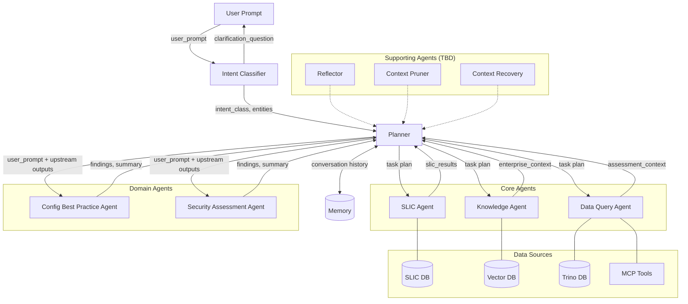

# Logical Architecture: Assessment Agentic AI

**Purpose:** Define the logical view of the Assessment Agentic Architecture — the agents, their responsibilities, relationships, and data flows. This view is **deployment-independent**: it describes *what* agents exist and *how* they interact, not *where* or *how* they run.

**Date:** 2026-02-27

**Relationship to other documents:**
- [deployment_options.md](deployment_options.md) — the **deployment/physical view**: how these logical agents are mapped to runtime (services vs. graph nodes)
- [agents/*.md](agents/) — the **agent contracts**: detailed persona, inputs, outputs, and rules per agent

---

## 1. Agent Taxonomy

The architecture defines four categories of agents. All agents are LLM-powered with distinct personas and responsibilities. Every agent exposes one or more **skills** — the functional units of capability that define what the agent can do.

> **Agent** = the actor (persona, contract, runtime identity).  
> **Skill** = a specific capability within an agent (defined inputs, outputs, invocation rules).  
> The Planner routes to an **agent** and specifies which **skill** to invoke.

### Orchestration Agents

| Agent | Role | Skill(s) | Primary Responsibility |
|---|---|---|---|
| **Semantic Router / Intent Classifier** | Pre-processor | `intent_classification` | Classify user intent, extract entities, determine routing. Short-circuits on ambiguity (clarification gate). |
| **Supervisor / Planner** | Orchestrator | `task_planning` | Convert classified intent into a task plan, determine agent routing, manage execution ordering. |

### Core Agents

| Agent | Role | Skill(s) | Data Source | Primary Responsibility |
|---|---|---|---|---|
| **SLIC Agent** | Data Retriever | `slic_retrieval` | SLIC DB / Engine | Retrieve SLIC results and annotations for downstream enrichment. |
| **Knowledge Agent** | Domain Expert | `knowledge_retrieval` | Vector DB (RAG) | Formulate retrieval queries, provide enterprise knowledge (policies, standards, exceptions) to support assessment execution. |
| **Data Query Agent** | Infrastructure Expert | `data_query_mcp`, `data_query_sql` | Trino DB / MCP Tools | Retrieve and normalize device/network data into a canonical Assessment Context. Queries DB directly or via MCP tools with predefined queries. |

### Domain Agents

| Agent | Role | Skill(s) | Primary Responsibility |
|---|---|---|---|
| **Config Best Practice Agent** | Validator | `cbp_assessment`, `cbp_expert_insights`, `cbp_generic` | Analyze assessment data, summarize findings, assess configuration posture against best practices. |
| **Security Assessment Agent** | Validator | `sec_assessment`, `sec_expert_insights`, `sec_generic` | Identify security risks and posture issues based on available data. Evidence-based, explicit about exposure assumptions. |

### Supporting Agents (TBD)

| Agent | Role | Skill(s) |
|---|---|---|
| **Reflector** | Quality gate | `answer_reflection` (TBD) |
| **Context Pruner** | Context management | `context_summarization` (TBD) |
| **Context Recovery** | Context management | `context_recovery` (TBD) |

> The Ambiguity Handler is **not a separate agent** — ambiguity is handled by the Intent Classifier's `intent_classification` skill (clarification gate).

---

## 2. Skill Catalog

Skills are the universal unit of capability across the architecture. Every agent — orchestration, core, and domain — is built from skills. A skill defines specific inputs, outputs, and invocation conditions.

### Orchestration Skills

| Skill | Agent | Inputs | Outputs | Invocation |
|---|---|---|---|---|
| `intent_classification` | Intent Classifier | `user_prompt`, `context_kv` | `intent_class`, `meta_intent`, `domain_details`, `entities[]`, `confidence`, `clarification_question` | Always — first node in every execution |
| `task_planning` | Planner | `STATE.intent.*` | `plan.tasks[]`, `plan.routing[]` | Always (when `intent_class != "unknown_or_needs_clarification"`) |

### Core Agent Skills

| Skill | Agent | Inputs | Outputs | Invocation |
|---|---|---|---|---|
| `slic_retrieval` | SLIC Agent | Intent entities, task definition | `task.outputs.slic_results`, `task.outputs.annotations` | Conditional — when SLIC data is needed (e.g., `cbp_expert_insights`) |
| `knowledge_retrieval` | Knowledge Agent | Intent, plan context, conversation history | `task.outputs.enterprise_context`, `task.outputs.retrieval_query` | Conditional — always for `cbp_expert_insights`/`cbp_generic`; conditional for others |
| `data_query_mcp` | Data Query Agent | `intent_class`, `entities[]`, MCP tool definitions | `task.outputs.assessment_context` | When intent maps to a supported MCP tool |
| `data_query_sql` | Data Query Agent | `intent_class`, `entities[]`, `schema`, `ontology` | `task.outputs.assessment_context` | When intent is complex/bespoke or MCP unavailable |

### Domain Agent Skills

| Skill | Agent | Required Upstream | Outputs | Trigger |
|---|---|---|---|---|
| `cbp_assessment` | Config Best Practice Agent | Data Query Agent (always), Knowledge Agent (conditional) | `findings[]`, `summary`, `prioritized_risks[]`, `asset_trend[]`, `chart_hints[]` | `intent_class == "cbp_assessment"` |
| `cbp_expert_insights` | Config Best Practice Agent | SLIC Agent (always), Data Query Agent (always), Knowledge Agent (always) | `findings[]`, `summary` | `intent_class == "cbp_expert_insights"` |
| `cbp_generic` | Config Best Practice Agent | Knowledge Agent (always) | `summary` | `intent_class == "cbp_generic"` |
| `sec_assessment` | Security Assessment Agent | Data Query Agent (always), Knowledge Agent (conditional) | `findings[]`, `summary`, `prioritized_risks[]` | `intent_class == "sec_assessment"` |
| `sec_expert_insights` | Security Assessment Agent | SLIC Agent (always), Data Query Agent (always), Knowledge Agent (always) | `findings[]`, `summary` | `intent_class == "sec_expert_insights"` |
| `sec_generic` | Security Assessment Agent | Knowledge Agent (always) | `summary` | `intent_class == "sec_generic"` |

### Supporting Agent Skills (TBD)

| Skill | Agent | Purpose |
|---|---|---|
| `answer_reflection` | Reflector | Critique and refine task results for quality |
| `context_summarization` | Context Pruner | Summarize conversation to mitigate semantic bloat |
| `context_recovery` | Context Recovery | Recover missing context in multi-turn scenarios |

### Skill Selection Logic

The Planner selects which skill to invoke on each agent based on `intent_class`:

```
intent_class ──▶ domain agent + skill
              ──▶ required core agent skills (from skill's data dependencies)
```

For example, `intent_class = "cbp_expert_insights"` triggers:
1. `slic_retrieval` on SLIC Agent (required)
2. `data_query_mcp` or `data_query_sql` on Data Query Agent (required)
3. `knowledge_retrieval` on Knowledge Agent (required)
4. `cbp_expert_insights` on Config Best Practice Agent (target skill)

---

## 3. Agent Relationships

```
                          ┌──────────┐
                User ────▶│ Intent   │
                          │Classifier│
                          └────┬─────┘
                               │
              ┌────────────────┼──── intent_class == "unknown_or_needs_clarification"
              │                │     → return clarification_question to User
              │                ▼
              │          ┌──────────┐       ┌──────────┐
              │          │ Planner  │◄─────▶│  Memory  │
              │          └──┬───┬───┘       └──────────┘
              │             │   │
              │    ┌────────┘   └────────┐
              │    ▼                     ▼
              │  Core Agents         Domain Agents
              │  ┌──────────┐        ┌──────────────────┐
              │  │ SLIC     │        │ Config Best      │
              │  │ Knowledge│───────▶│ Practice Agent   │
              │  │ Data Qry │        │ Security Assess. │
              │  └──────────┘        │ Agent            │
              │                      └──────────────────┘
              │
              ▼
           User (clarification)
```

**Key relationships:**

1. **User → Intent Classifier**: Every user prompt enters through the Intent Classifier
2. **Intent Classifier → Planner**: Classified intent (unless clarification needed)
3. **Intent Classifier → User**: Clarification question (short-circuit, pre-Planner gate)
4. **Planner → Core Agents**: Conditional invocation based on data dependencies
5. **Planner → Domain Agents**: Always invoked (one per intent_class)
6. **Core Agents → Domain Agents**: Data flows through the Planner (task outputs), not direct calls
7. **Planner ↔ Memory**: Conversation history, personalization, self-corrections

---

## 4. Data Flow

The architecture follows a **Planner/Execute** pattern. The Planner determines which agents run, in what order, and what data each agent needs. This section describes the logical data flow: **what** each agent produces and consumes, and **how** data moves between agents.

### 4.1 Data Flow Principles

- **Planner-mediated** — all inter-agent data flow is mediated by the Planner. Agents do not call each other directly; the Planner decides what each agent receives and collects what each agent produces.
- **Task-scoped** — each agent produces outputs for the specific task it was assigned. Those outputs are available to downstream agents as inputs.
- **Non-overlapping** — each agent produces a distinct set of outputs. No two agents produce the same artifact, so there is no risk of overwriting.
- **Traceable** — every agent's execution contributes to an observable trace.

### 4.2 Data Contracts

Each agent produces and consumes well-defined data artifacts.

**Intent Classifier produces:**
- `intent_class` — single classification label
- `meta_intent` — conversational-level intent
- `domain_details` — structured assessment metadata
- `entities[]` — targets, scope, constraints
- `confidence` — 0–1 score
- `clarification_question` — only when ambiguous

**Planner produces:**
- `tasks[]` — ordered task list with agent assignments, dependencies, and embedded data requirements
- `routing[]` — agent-to-task mapping

**Core Agents produce (per task):**
| Agent | Output Artifact | Description |
|---|---|---|
| SLIC Agent | `slic_results`, `annotations` | SLIC assessment results and annotations |
| Knowledge Agent | `enterprise_context`, `retrieval_query` | RAG-retrieved policies, standards, exceptions + the query used |
| Data Query Agent | `assessment_context` | Normalized device/network data (via MCP tools or SQL) |

**Domain Agents produce (per task):**
| Output Artifact | Description |
|---|---|
| `findings[]` | Structured findings with severity, confidence, evidence |
| `summary` | Natural language summary of analysis |
| `prioritized_risks[]` | Risk-ranked findings |
| `asset_trend[]` | Trend/delta analysis (Config Best Practice Agent, trend mode) |
| `chart_hints[]` | Chart-ready data metadata for UI rendering (optional) |

### 4.3 Example Data Flows by Skill

Each `intent_class` maps to a domain agent skill, which in turn determines which core agent skills are invoked and what data flows between them. Two examples illustrate the pattern:

#### `cbp_assessment` (Config Best Practice Agent skill)
User asks about assessment results, findings, statistics, trends, risk, or remediation.

```
Intent Classifier ──▶ Planner ──▶ Data Query Agent (always) ──▶ Knowledge Agent (conditional) ──▶ Config Best Practice Agent
                                        │                              │                                │
                                        │                              │                                ▼
                                        │                              │              reads: assessment_context (from Data Query Agent)
                                        │                              │              reads: enterprise_context (from Knowledge Agent, if available)
                                        │                              │              writes: findings[], summary, prioritized_risks[]
                                        │                              ▼
                                        │              writes: enterprise_context, retrieval_query
                                        ▼
                                  writes: assessment_context (via MCP tools or SQL)
```

#### `cbp_expert_insights` (Config Best Practice Agent skill)
Assessment data contains SLIC findings that must be enriched with enterprise knowledge. This is the fullest pipeline — all core agents are invoked.

```
Intent Classifier ──▶ Planner ──▶ SLIC Agent (always) ──▶ Data Query Agent (always) ──▶ Knowledge Agent (always) ──▶ Config Best Practice Agent
                                        │                        │                            │                            │
                                        ▼                        ▼                            ▼                            ▼
                                  writes: SLIC            writes: assessment           writes: enterprise           reads: all upstream
                                  results                 context                      context                      writes: findings[], summary
```

The remaining skills (`cbp_generic`, `sec_assessment`, `sec_expert_insights`, `sec_generic`, `unknown_or_needs_clarification`) follow the same pattern with varying core agent invocations as defined in §2 Skill Catalog.


---

## 5. Data Sources

| Data Source | Accessed By | Contains |
|---|---|---|
| **SLIC DB / Engine** | SLIC Agent | SLIC assessment results, annotations |
| **Vector DB** | Knowledge Agent | Human annotations, institutional knowledge, policies, standards, approved exceptions |
| **Trino DB** | Data Query Agent | Assessment metadata, raw configuration data, schema cache, runtime context |
| **MCP Tools** | Data Query Agent | `assessment_analysis_tool`, `assessment_comparison_tool`, `issue_tracking_tool` — predefined queries for common assessment operations |

### Data Query Agent: Dual-Path Retrieval

The DQA has two retrieval strategies, selected deterministically:

| Path | When Used | How It Works |
|---|---|---|
| **MCP Path** | Intent maps to a supported MCP tool | Select tool by intent_class + entities → execute → normalize results |
| **SQL Path** | Complex/bespoke intent, or MCP unavailable | Read schema + ontology → generate read-only SQL → execute → normalize results |

---

## 6. Execution Model

### 6.1 Single-Pass Planner/Execute

The execution follows a deterministic, single-pass pattern:

1. **Classify** — Intent Classifier produces `intent_class`, `entities[]`, `confidence`
2. **Gate** — If ambiguous (`confidence < 0.5`), return clarification question to user (short-circuit)
3. **Plan** — Planner reads intent, builds ordered `tasks[]` with dependencies and routing
4. **Execute** — Tasks run sequentially respecting `depends_on[]`:
   - Core agents run first (conditional, based on data dependencies)
   - Domain agents run last (always, consume upstream outputs)
5. **Return** — Final STATE with all task outputs is returned

There is **no replanning** in the current architecture. If data is insufficient, domain agents qualify their findings with `data_gaps[]`, `assumptions[]`, and lower `confidence` scores rather than requesting re-execution.

### 6.2 Conditional Invocation Rules

The Planner invokes agents by skill, based on the domain skill's data dependencies (see §2 Skill Catalog):

| Agent | Skill(s) | Invocation Rule |
|---|---|---|
| **SLIC Agent** | `slic_retrieval` | When SLIC data is needed (e.g., `cbp_expert_insights`, `sec_expert_insights`) |
| **Knowledge Agent** | `knowledge_retrieval` | Always for `*_expert_insights` and `*_generic`; conditional for `*_assessment` |
| **Data Query Agent** | `data_query_mcp` or `data_query_sql` | Always for `*_assessment` and `*_expert_insights`; never for `*_generic` |
| **CBP Agent** | `cbp_assessment`, `cbp_expert_insights`, or `cbp_generic` | When `intent_class` ∈ {`cbp_assessment`, `cbp_expert_insights`, `cbp_generic`} |
| **SA Agent** | `sec_assessment`, `sec_expert_insights`, or `sec_generic` | When `intent_class` ∈ {`sec_assessment`, `sec_expert_insights`, `sec_generic`} |

### 6.3 Memory

The Planner has access to a Memory store containing:
- **Conversation history** — multi-turn context
- **Personalization** — user preferences and context
- **Self-corrections** — prior corrections applied during the session
- **Agent memory** — learned patterns from prior executions

Memory is a shared resource used by the Planner for context-aware planning. It is not a separate agent.

---

## 7. Invariants

These properties hold true for the logical architecture:

1. **Every agent is built from skills** — skills are the universal unit of capability; agents are containers for one or more skills
2. **Agent contracts are stable** — each agent's persona, skills, inputs, outputs, and rules are defined in `agents/*.md`
3. **Data flows through the Planner** — agents do not call each other directly; the Planner mediates all inter-agent data flow
4. **Task-scoped outputs** — each agent produces outputs for the specific task it was assigned; no two agents produce the same artifact
5. **Single-pass execution** — no replanning, no cycles (Phase 1)
6. **Clarification gate is pre-Planner** — ambiguity resolution happens before any planning or execution
7. **Domain agents never fetch data** — they consume upstream task outputs only
8. **Planner never fetches data** — it orchestrates, delegates, and aggregates
9. **Intent Classifier never plans** — it classifies and extracts, nothing more
10. **Trace provenance** — every agent appends execution trace for observability

---

## 8. Logical Architecture Diagram (Mermaid)



---

## 9. What This Document Does NOT Cover

This logical view is deliberately deployment-agnostic. The following concerns are addressed in other documents:

| Concern | Document |
|---|---|
| How agents are deployed (services vs. graph nodes) | [deployment_options.md](deployment_options.md) |
| Whether core agents are shared or duplicated per domain | [deployment_options.md](deployment_options.md) |
| Communication protocol (A2A, HTTP, shared state) | [deployment_options.md](deployment_options.md) |
| Scaling, containers, process boundaries | [deployment_options.md](deployment_options.md) |
| SOA vs. LOA architectural strategy | [Architectural Strategy v4.md](Architectural%20Strategy%20v4.md) |
| Graph transition rules and edge conditions | [graph/graph_flow.md](graph/graph_flow.md) |
| Individual agent contracts (full detail) | [agents/*.md](agents/) |
